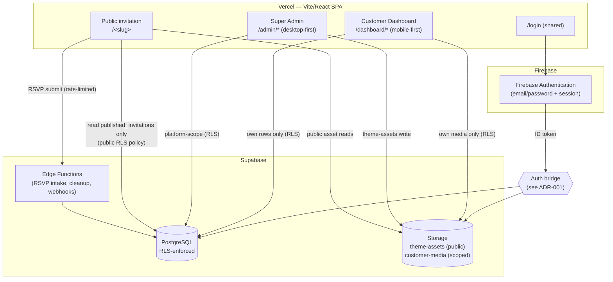
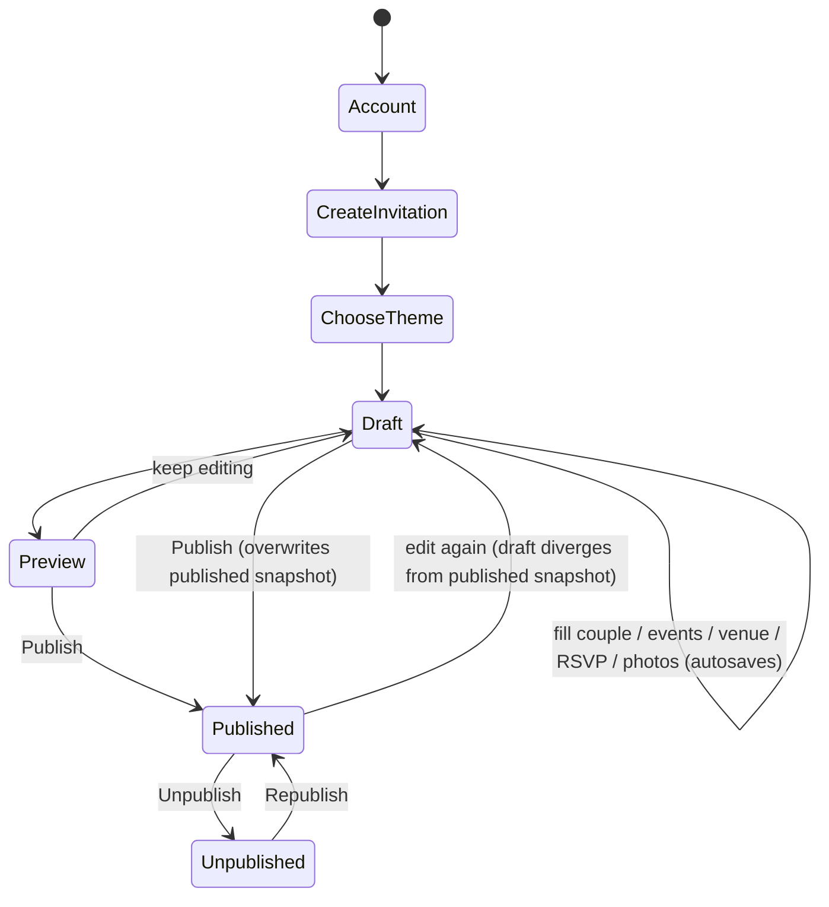
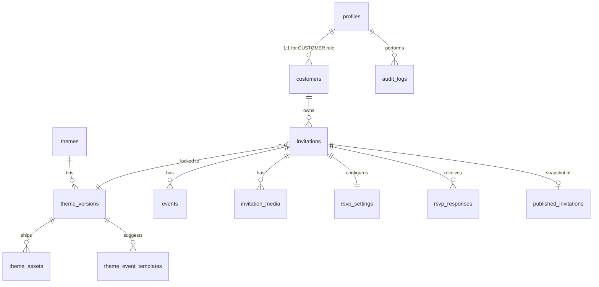
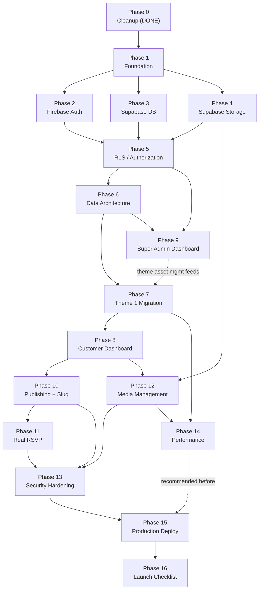

# IMPLEMENTATION_PLAN.md — Neozy Invi Platform Architecture

**Status:** Architecture & planning document. **Nothing in this document has been implemented.**
**Prepared:** 2026-09-21, against commit following the Phase-0 cleanup described in Section 3.
**Input documents:** `PRODUCT_AUDIT.md` (verified, not blindly trusted — every load-bearing claim from it was re-checked against source in this session before being relied on here).

This document is written against the **actual** Neozy Invi codebase — its real component tree, its real (currently broken) data flows, and its real Theme 1 asset library — not a generic SaaS template. Every architectural boundary proposed here is derived from where the current code already draws a line (e.g. `theme.assets.*` vs. hardcoded paths) or from where it fails to draw one (e.g. `localStorage` standing in for a database).

---

## 1. EXECUTIVE SUMMARY

Neozy Invi today is a **single-tenant, front-end-only wedding invitation** for one couple ("Abhay & Gunjan"), wrapped in an admin panel that edits that one couple's data into the *admin's own browser's* `localStorage`. It is visually and animation-wise a strong, bespoke product (see `PRODUCT_AUDIT.md` Section 15). It has no backend, no real authentication, no cross-device data sharing, and no way for a second couple to use it without a developer manually editing `src/data/invitation.ts` and redeploying.

This plan turns it into a real multi-tenant platform with two roles (`SUPER_ADMIN`, `CUSTOMER`), a Firebase-authenticated identity layer, a Supabase-backed data/storage layer, and a formal **Theme contract** that lets the current Theme 1 experience keep working exactly as it does today while making a future Theme 2 a matter of writing a new presentation package against a shared data shape — not rebuilding authentication, RSVP, publishing, or customer management again.

**This document does not implement anything.** Section 3 lists the small, backend-independent cleanup already performed before writing this plan (see the separate final report for exact files touched). Everything else here is architecture to be executed phase-by-phase per Section 35.

---

## 2. CURRENT SYSTEM UNDERSTANDING

### 2.1 Stack (verified)
React 19 + TypeScript + Vite 8, `react-router-dom` v7 `BrowserRouter`, Tailwind v4 used minimally (most styling is inline `style` objects), `oxlint` for linting, no test framework, no backend SDKs of any kind in `package.json`.

### 2.2 Routing (verified, `src/App.tsx`)
```
/                → PublicInvitation
/demo            → PublicInvitation   (alias)
/invitation      → PublicInvitation   (alias)
/:slug           → PublicInvitation   (slug is captured but NEVER read via useParams — dead)
/admin/login     → AdminLogin (public)
/admin           → RequireAdmin(AdminLayout) → AdminDashboard (index)
/admin/edit      → AdminEdit
/admin/events    → AdminEvents
/admin/gallery   → AdminGallery
/admin/rsvp      → AdminRsvp
/admin/music     → AdminMusic
/admin/theme     → AdminTheme
/admin/preview   → AdminPreview
/admin/settings  → AdminSettings
*                → redirect to /
```
`RequireAdmin` gates the whole `/admin` subtree on `isAdminAuthenticated()` (`sessionStorage` flag). `adminAuth.ts` checks a **hardcoded plaintext email/password pair compiled into the client bundle**. There is exactly one login entry point already (`/admin/login`) — this is a real asset for the new architecture; we are extending it, not replacing it.

### 2.3 Data flow (verified)
```
src/data/invitation.ts   — InvitationData shape + ONE hardcoded default object (single couple)
        ↓
src/data/store.ts        — invitationStore: get/set/patch/subscribe/reset,
                             persisted to localStorage["neozy-invi:invitation-data"],
                             includes a "reconcile" merge + a legacy-asset-path
                             migration table (both real, useful patterns — see 34.1)
        ↓
src/data/useStore.ts     — useInvitationStore() React hook (subscribe + rerender)
        ↓
PublicInvitation.tsx / every Admin*.tsx page — read/write invitationStore directly
```
`src/services/rsvp.ts` is a **second, independent** localStorage store (`neozy-invi:rsvp-submissions`) with its own `RsvpService` interface — already shaped like a swappable backend (`submit()`/`getAll()`), just never given a real implementation. This interface shape is worth keeping.

### 2.4 Theme system (verified, `src/data/themes.ts`)
`ThemeConfig` = `{ id, name, category, description, palette, fonts, assets, motifs, layout, paperWorld, ornamentation, motion }`. Six theme objects exist (`classic-gold`, `royal-maroon`, `garden-pastel`, `emerald-mughal`, `arabesque-blue` + one more), but **only `palette`, `motifs`, `layout`, `paperWorld`, `ornamentation`, `motion` are ever actually overridden** per theme. `assets` (photos, event backgrounds, album art, venue/closing images) is `...structuredClone(BASE)` for every single theme — i.e. **there is exactly one real asset library today, Theme 1's**, reused unchanged even by themes whose `category` is `"Muslim"`. `useTheme.ts` resolves the active theme by `invitation.settings.themeId` and applies palette values as CSS custom properties.

**Critically:** the single most important visual asset — the gate-cinematic video, which opens on a Hindu Ganesha medallion per `CoupleIntro.tsx`'s own header comment — is a **module-level hardcoded constant in `CoupleIntro.tsx`**, not read from `theme.assets` at all. No theme, current or hypothetical, can change it today. This is the single fact that most shapes the Theme Architecture in Section 11.

### 2.5 Theme 1 asset library (verified, post-cleanup — see Section 3)
```
public/themes/theme-1/
  images/
    cover.jpg                        — Cover.tsx tap-target AND themes.ts closingImage (intentional dual-use)
    save-the-date-background.jpg     — DateReveal scene background (theme.assets.dateRevealPoster)
    scratch.png                      — DateReveal's scratch-off cover art (hardcoded 500×500 in DateReveal.tsx)
    wedding-hands.png                — CoupleIntro's union symbol (hardcoded path in CoupleIntro.tsx)
    mehendi-background.jpg           — EventsSection: theme.assets.eventBackgrounds.mehendi
    sangeet-background.jpg           — theme.assets.eventBackgrounds.sangeet
    haldi-background.jpg             — theme.assets.eventBackgrounds.haldi
    wedding-background.jpg           — theme.assets.eventBackgrounds.wedding
    reception-background.jpg         — theme.assets.eventBackgrounds.reception
    couple1.jpg … couple5.jpg        — theme.assets.albumArt (couple-photo-album fallback plates)
  videos/
    gate-cinematic.mp4               — hardcoded in CoupleIntro.tsx, NOT theme-driven
  audio/
    wedding-music.mp3                — invitation.music.src (data-driven, not theme-driven)
  fonts/telma/Telma-Bold.woff2       — self-hosted couple-name display face
```
`theme.assets.venueImage` had no corresponding file (`couple-poster.jpg` never existed) — fixed in the Section 3 cleanup by pointing it at an explicit empty slot rather than a dead path or a borrowed, ambiguous asset (see Section 3.2 and Open Decision OD-1).

### 2.6 Invitation flow (verified)
Cover (tap) → gate-cinematic video (welcome text → couple names/parents/wedding-hands) → Date Reveal (scratch → date → countdown → celebration burst) → Events chapter (title page + 5 ceremony pages, one per full-screen scene) → Couple Photo album (one full-screen photo per scene) → Venue → RSVP → Closing. The first block (Cover through the photo album) is driven by a **bespoke scroll-hijacking reel** (`useReelPager.ts`) keyed off `[data-reel-scene]` elements; Venue/RSVP/Closing are normal document-flow sections below the reel. This entire mechanism is pure client-side DOM measurement — it has **no dependency on where the data came from**, which is exactly why it can be preserved unchanged through this migration.

### 2.7 What will conflict with a Supabase/Firebase architecture if left as-is
- `invitationStore`/`useStore.ts` assume a single global `InvitationData` object for the whole app. A multi-tenant app needs "the invitation currently being viewed/edited," not "the one true invitation."
- `rsvpService.getAll()` returns every submission ever made, globally — needs to become "RSVP responses for invitation X," authorized to invitation X's owner only.
- `adminAuth.ts`'s hardcoded credentials must be deleted, not extended.
- `CoupleIntro.tsx`'s hardcoded `GATE_VIDEO_SRC`/`GATE_VIDEO_POSTER` constants must become theme-asset-slot lookups so a customer's own Theme 1 invitation can (eventually) point at Super-Admin-managed Theme 1 media without a code change.
- `theme.assets.albumArt` (Theme fallback plates) and `invitation.gallery` (customer's own uploads) already model the "Theme asset vs. Customer asset" distinction correctly in one place (`CouplePhotoExperience.tsx`: `uploaded.length > 0 ? uploaded : albumArt`) — this is the pattern to generalize platform-wide, not reinvent.

---

## 3. CURRENT PROBLEMS (cleanup already performed vs. still open)

### 3.1 Fixed in this pass (backend-independent, see final report for the exact diff)
- Removed 19 of 26 dead CSS `@keyframes` and all 14 dead `.animate-*` utility classes from `src/index.css` (656 → 396 lines; confirmed via exhaustive grep that nothing in any component referenced them).
- Removed 5 stray/duplicate files at `public/themes/theme-1/` root (`couple-background.jpg`, `cover.jpg`, `gate-cinematic.mp4`, `savethedate.jpg`, `scratch.png`) and one accidental screenshot (`Screenshot 2026-09-20 231107.png`) — none were referenced anywhere in source; only the copies under `images/`/`videos/` were ever used.
- Renamed the event/save-the-date images to explicit section-scoped names (`mehendi.jpg` → `mehendi-background.jpg`, etc. — see Section 11.4 for the full mapping) so a future asset manager can present them as unambiguous, named slots instead of bare ceremony-name files that happen to also be Hindi/English words.
- Fixed the broken `theme.assets.venueImage` reference (previously pointed at a file — `couple-poster.jpg` — that has never existed). It is now explicitly empty rather than pointed at a borrowed, ambiguous asset — see Open Decision OD-1.
- Documented, rather than duplicated, the intentional shared use of `cover.jpg` by both `Cover.tsx` and `theme.assets.closingImage` (the invitation is designed to close on the same portrait it opens on) — per the explicit instruction to document genuine reuse instead of manufacturing an unnecessary duplicate file.
- Removed the orphaned `scripts/qa.mjs` (wrong dev-server port, a Linux-container-only Chromium path, and timing assumptions from a video that is 2.4× longer today) and its `npm run qa` script entry; removed the now-unused `playwright` devDependency and resynced `package-lock.json`.
- Removed dead data fields that were either unrenderable anywhere (`CoupleData.header`, `.body`, `.scriptAccent`, `.inviteLine`, `.tagline`; `EventData.icon`, `.image`) or editable in the admin UI but silently rendered nowhere (`CoupleData.header`/`.body` had live form fields in `AdminEdit.tsx`; `EventData.description` had a live textarea in `AdminEvents.tsx`) — removed the form fields alongside the data fields so the admin UI no longer promises an effect it can't deliver.
- Verified `npm run build` and `npm run lint` are clean after every change above.

### 3.2 Consciously **not** fixed in this pass, and why
- **`theme.assets.venueImage` still has no real photograph.** No image in the current asset library is an honest, non-borrowed substitute (see Open Decision OD-1) — inventing one would be a content/design decision, not a technical cleanup.
- **Three dead legacy-migration targets remain** in `src/data/store.ts`'s `LEGACY_ASSET_PATHS` table (`couple-poster.jpg`, `ganesha.png`, `couple-background.mp4` — all pre-date the current asset reorganization and were already unreachable before this pass). These only matter to a browser holding years-old `localStorage` data from before the Theme 1 reorganization; they are backward-compatibility shims, not live bugs, and this entire mechanism is superseded by Section 15/34 once real persistence exists. Left alone rather than guessed at.
- **The Mehendi/Sangeet/Haldi/Reception default event dates remain chronologically broken** (all fall after the wedding day) — this is sample **content**, not a technical defect, and is explicitly a Section 34 (migration/seed data) concern, not a Part-2-style cleanup item.
- **No visual/animation change of any kind was made.** Theme 1's cinematic identity is preserved exactly.

---

## 4. PRODUCT VISION

Neozy Invi becomes a **digital invitation platform**: a couple signs up, builds their own invitation against an available theme, publishes it to a unique URL, and manages RSVPs from their phone — without a developer touching code. The developer's job becomes running the platform, building/maintaining themes, and supporting customers. A `SUPER_ADMIN` role runs the business side (customers, themes, assets, platform health); a `CUSTOMER` role runs their own wedding.

---

## 5. FINAL ARCHITECTURE



**Boundary summary** (the question the prompt asks me to think hardest about):

| Boundary | Owner | Lives in |
|---|---|---|
| Identity (who are you) | Firebase Auth | Firebase |
| Role (what can you do) | Platform | Supabase `profiles.role` |
| Customer account & invitation data | Platform | Supabase `customers`, `invitations` |
| Theme definition (schema, slots, config) | Platform + Super Admin | Supabase `themes`, `theme_versions` |
| Theme presentation (JSX/CSS/animation) | Codebase, per theme package | `src/themes/theme-1/**` (the current component tree, relocated, not rewritten) |
| Theme assets (opening video, ceremony backgrounds, etc.) | Super Admin | Supabase Storage `theme-assets/` bucket |
| Customer assets (their own photos) | Customer, scoped | Supabase Storage `customer-media/` bucket |
| Published, guest-visible content | Platform (write-once-per-publish) | Supabase `published_invitations` |
| RSVP responses | Platform, owner-scoped | Supabase `rsvp_responses` |
| Super Admin control plane | Super Admin only | `/admin/*` + Supabase platform tables |

---

## 6. TECHNOLOGY RESPONSIBILITIES

| Concern | Technology | Why |
|---|---|---|
| Signup/login/session | **Firebase Authentication** | Per explicit requirement; mature, low-maintenance, free tier is generous for a low-budget launch |
| Role identity | Firebase custom claim (`role`) **mirrored** into Supabase `profiles.role` | Firebase claims are the fastest client-side check for UI branching; Supabase's copy is the one RLS actually trusts (see ADR-008) — never trust a client-readable claim alone for authorization |
| Relational data | **Supabase Postgres** | Per explicit requirement; real relations (customer→invitation→events/media/RSVP) need real foreign keys and RLS, not a document blob |
| File storage | **Supabase Storage** | Per explicit requirement; native RLS-integrated buckets, signed URLs, CDN-fronted public buckets |
| Serverless glue (RSVP spam-guard, auth bridging if needed, orphan-asset cleanup) | **Supabase Edge Functions** (or Vercel Serverless Functions — see ADR-001) | Small, stateless, no reason to introduce a third platform |
| Hosting | **Vercel** (unchanged) | Already in place; SPA + serverless functions supported natively |
| Frontend | React 19 + Vite + TS (unchanged) | Already proven, no reason to rewrite |

**No other backend platform is introduced.** No new frontend framework, no state-management library beyond what a Supabase JS client + light React context needs (see Section 8 for why a heavier state library is not recommended for V1 — Complexity/Cost Section 43).

---

## 7. AUTHENTICATION ARCHITECTURE

### 7.1 Flow
1. Guest visits `/login` (shared entry point, replaces the idea of two separate login pages).
2. Firebase Authentication (email/password for V1 — see Open Decision OD-2 on whether to add Google sign-in) issues an ID token on success.
3. The app reads the user's role. **Role is not decided client-side.** On first successful Firebase login, the client calls a small server-side function (Edge Function) that:
   - verifies the Firebase ID token server-side (Firebase Admin SDK),
   - looks up or creates a `profiles` row keyed by `firebase_uid`,
   - returns `{ role, customer_id | null }`.
4. The client stores the resolved role in memory (React context) — **never** trusts a locally-cached role across a token refresh without re-verifying, to close the "change browser state" attack the prompt explicitly calls out.
5. Router redirects: `SUPER_ADMIN` → `/admin`, `CUSTOMER` → `/dashboard`.
6. Every subsequent Supabase request carries the Firebase ID token (or its Supabase-bridged equivalent — ADR-001), and **RLS, not the client, is the real authorization boundary.**

### 7.2 Why one shared login page
The current codebase already has exactly one gate (`/admin/login`) protecting one subtree. Extending it to branch by role after authentication (rather than building a second, parallel login flow for customers) avoids duplicating auth logic — directly satisfying the "do not duplicate authentication logic" requirement.

---

## 8. USER ROLES

| Role | Interface | Core capability | Cannot |
|---|---|---|---|
| `SUPER_ADMIN` | Desktop-first `/admin/*` | Manage platform: customers, invitations (inspect/support), themes, theme assets, RSVP oversight, settings, audit | Cannot bypass RLS from the client — server-role actions that need elevated privilege go through Edge Functions using the Supabase **service role key**, which never reaches the browser (see ADR-007/Part 11) |
| `CUSTOMER` | Mobile-first `/dashboard/*` | Create/manage own invitation(s), theme selection (from published/available themes), content, media, events, venue, RSVP config, publish, view own RSVP responses | Cannot read/write another customer's `invitations`/`rsvp_responses`/media rows (enforced by RLS, not UI hiding); cannot write to `themes`/`theme_versions`/theme asset storage |
| *(implicit)* `PUBLIC` | No login | Read a **published** invitation by slug; submit RSVP to it | Cannot read draft/unpublished content, another customer's data, or platform tables |

No third role is introduced for V1 (per "do not over-engineer roles"). A future `SUPPORT_AGENT` (limited Super-Admin subset) is noted as a **P2 future option**, not built now.

---

## 9. SUPER ADMIN ARCHITECTURE

Desktop-first control center. Every module below is justified individually, not added by default.

| Module | Why it exists | Access | Data (Supabase) | Storage | Immutable | Editable | Versioned | Needs confirm | Logged |
|---|---|---|---|---|---|---|---|---|---|
| **Dashboard** | At-a-glance platform health: active customers, published invitations, RSVP volume, recent signups | SUPER_ADMIN | Aggregated reads across `customers`, `invitations`, `rsvp_responses` | — | — | — | — | — | view only, not logged |
| **Customers** | Support a couple without touching their invitation directly; suspend abuse | SUPER_ADMIN | `customers`/`profiles` | — | `firebase_uid` | status (active/suspended), notes | — | suspend action | yes |
| **Invitations** | Inspect any customer's invitation for support/debugging; force-unpublish if abused | SUPER_ADMIN | `invitations`, `published_invitations` | read-only media links | published snapshot | status | yes (published snapshot itself) | unpublish action | yes |
| **Themes** | Create/activate/retire theme offerings | SUPER_ADMIN | `themes` | preview image refs | `id` once in use | name, description, status | — | activate/retire | yes |
| **Theme Versions** | Ship an improved Theme 1 without breaking existing customers (ADR-004) | SUPER_ADMIN | `theme_versions` | — | once published & in use by ≥1 invitation | draft versions only | **yes — this table's whole purpose is versioning** | publish new version | yes |
| **Theme Assets** | Manage the shared media a theme ships with (gate video, ceremony backgrounds, etc.) | SUPER_ADMIN | `theme_assets` (metadata rows) | `theme-assets/` bucket | asset id once referenced by a published theme version | replace file (creates new version-scoped asset row, doesn't mutate history — see Section 15) | yes, per theme version | replace/delete | yes |
| **Event Templates** | Optional starter events per theme (e.g. Theme 1 ships default Mehendi/Sangeet/Haldi/Wedding/Reception names+order a customer can start from) | SUPER_ADMIN | `theme_event_templates` | — | — | full CRUD | — | delete | yes |
| **Media Library** | Cross-customer view for support (e.g. "this photo won't load") — **not** a general file browser | SUPER_ADMIN | `invitation_media` (read) | signed-URL read of `customer-media/` | customer-owned | — | — | — | view access itself is logged (privacy) |
| **RSVP Management** | Oversight/support (e.g. a customer reports RSVP not saving) — Super Admin reads, does not edit guest answers | SUPER_ADMIN | `rsvp_responses` (read) | — | guest-submitted rows | — | — | — | view access logged |
| **Users / Access** | Manage who has `SUPER_ADMIN` | SUPER_ADMIN (bootstrap: manual DB seed, see Section 36) | `profiles.role` | — | — | role assignment | — | **yes, always** | yes, always |
| **Platform Settings** | Reserved slugs list, feature flags, maintenance mode | SUPER_ADMIN | `platform_settings` | — | — | full | — | on sensitive flags | yes |
| **Audit Logs** | See Section 29 | SUPER_ADMIN | `audit_logs` | — | **always immutable, append-only** | never | n/a | n/a | is the log itself |
| **System Health** | Storage usage, RSVP submission rate, error rate — thin wrapper over Vercel/Supabase dashboards, not reinvented | SUPER_ADMIN | mostly external dashboards linked, minimal own data | — | — | — | — | — | — |

Not built: a general-purpose "theme editor" (explicitly out of scope per Part 20 — "avoid building a theme editor so complex it becomes design software").

---

## 10. CUSTOMER ARCHITECTURE

Mobile-first, multi-step, save-as-you-go.



### 10.1 States (explicit, per Part 7)
- **draft** — the customer's current working copy (`invitations` row, `status='draft'` conceptually distinct from publish state — see Section 20 for the exact modeling). Autosaved field-by-field or step-by-step (debounced), never lost on navigation away.
- **preview** — not a separate stored state; a read-only render of the CURRENT DRAFT, accessible only to the owning customer (and Super Admin for support), using the exact same theme presentation component the public page uses, fed draft data instead of published data.
- **published** — a snapshot has been written to `published_invitations`; the public `/<slug>` route now serves it.
- **unpublished** — the invitation has a slug and a (possibly stale) published snapshot, but is currently taken offline by the customer or Super Admin; `/<slug>` returns a "not currently available" page, not a 404 (the slug still belongs to them).
- **update** — not a separate status; simply "draft has changed since `published_invitations.published_at`" — computed by comparing an `updated_at` timestamp on the draft to `published_at`, so the customer dashboard can show "you have unpublished changes" without a dedicated state column.

### 10.2 Multi-step flow (mobile UX detail in Section 27)
Account → Create Invitation → Choose Theme → Couple Details → Photos (≤5) → Events → Venue → RSVP settings → Preview → Publish → Share → Manage/Edit/RSVP responses. Each step is its own screen/route (`/dashboard/invitations/:id/couple`, `/.../photos`, etc.), not one giant form — satisfying "do not force every field into one huge form."

---

## 11. THEME ARCHITECTURE

This is the part of the current codebase most in need of a real contract, because today "theme" means "six palette objects that all point at one hardcoded video."

### 11.1 The contract
A theme is **two things that must be versioned together**:
1. **Theme Definition** (data, in Supabase) — metadata, typography tokens, color tokens, the list of required **asset slots**, and which optional sections/features it supports.
2. **Theme Presentation** (code, in the repo) — a React package that takes `{ resolvedInvitationData, resolvedAssetUrls }` and renders the actual cinematic experience. **This is intentionally NOT a generic JSON-driven renderer.** Forcing Theme 2's visual structure to match Theme 1's would violate the explicit "do not force identical visual structure" requirement and would also be dishonest about what Theme 1 actually is (a specific, bespoke Hindu wedding film, not a generic slide deck).

```ts
// Conceptual shape — NOT final field names, subject to Section 41 ADR-003 review
interface ThemeDefinition {
  id: string;                 // "theme-1"
  slug: string;                // "classic-hindu-gold" (customer-facing)
  name: string;
  culturalIdentity: string;    // "Hindu" — HONEST, singular, not a color-only label (see ADR-003)
  status: "draft" | "active" | "retired";
  latestVersion: string;       // semver, e.g. "1.0.0"
  previewAssetSlot: string;    // which asset slot supplies the theme picker's preview
  requiredAssetSlots: AssetSlotDefinition[];
  optionalAssetSlots: AssetSlotDefinition[];
  supportedSections: SectionKey[];   // e.g. ["cover","coupleIntro","dateReveal","events","album","venue","rsvp","closing"]
  typography: { display: string; script: string; body: string; sc: string };
  colorTokens: Record<string, string>;  // the CURRENT ThemePalette shape, basically unchanged
  presentationPackage: string; // "theme-1" → resolves to src/themes/theme-1/*
}

interface AssetSlotDefinition {
  key: string;            // "opening_video"
  label: string;          // "Opening cinematic"
  kind: "video" | "image" | "audio";
  ownedBy: "theme" | "customer";  // see 11.3
  required: boolean;
  constraints: { maxSizeMb: number; mimeTypes: string[]; aspect?: string };
}
```

### 11.2 Theme 1's REAL asset slots (derived from the actual code, not invented)

| Slot key | Current hardcoded source | Owned by | Component that consumes it |
|---|---|---|---|
| `opening_video` | `CoupleIntro.tsx: GATE_VIDEO_SRC` (module constant — must be lifted out) | theme | CoupleIntro |
| `opening_video_poster` | `CoupleIntro.tsx: GATE_VIDEO_POSTER` | theme | CoupleIntro |
| `cover_image` | `Cover.tsx` hardcoded `cover.jpg` | theme | Cover |
| `closing_image` | `theme.assets.closingImage` (documented dual-use with `cover_image`) | theme | ClosingSection |
| `wedding_hands` | `CoupleIntro.tsx` hardcoded path | theme | CoupleIntro |
| `scratch_cover` | `DateReveal.tsx` hardcoded 500×500 asset | theme | DateReveal |
| `save_the_date_background` | `theme.assets.dateRevealPoster` | theme | DateReveal |
| `mehendi_background` | `theme.assets.eventBackgrounds.mehendi` | theme | EventsSection |
| `sangeet_background` | `theme.assets.eventBackgrounds.sangeet` | theme | EventsSection |
| `haldi_background` | `theme.assets.eventBackgrounds.haldi` | theme | EventsSection |
| `wedding_background` | `theme.assets.eventBackgrounds.wedding` | theme | EventsSection |
| `reception_background` | `theme.assets.eventBackgrounds.reception` | theme | EventsSection |
| `venue_background` | `theme.assets.venueImage` (currently empty — OD-1) | theme | VenueSection |
| `album_fallback_plates` | `theme.assets.albumArt` (array) | theme | CouplePhotoExperience |
| `background_music` | `invitation.music.src` | **customer** (already data-driven, not theme-driven — correct as-is) | PublicInvitation |
| `couple_photos` | `invitation.gallery` (≤5, customer upload) | **customer** | CouplePhotoExperience |
| `venue_photo` | `invitation.venue.image` (customer override of `venue_background`) | **customer** | VenueSection |

I did **not** invent a `ganesha`/`couple_hero`/`couple_poster` slot the prompt's own example list suggested, because no current code path renders a standalone Ganesha asset (it is baked into `opening_video`'s pixels) or a distinct "couple poster"/"couple hero" file — inventing slots for assets that don't exist in the real component tree would violate "do not invent arbitrary slots." If a future theme wants Ganesha as a separate, swappable layer (rather than baked into the video), that is a **theme design decision for that theme's own presentation package**, not a retrofit onto Theme 1's current video-only implementation.

### 11.3 Theme asset vs. customer asset — the exact rule
An asset slot is **theme-owned** if changing it changes the theme's visual identity for every couple using that theme (the ceremony paintings, the gate film, the scratch cover art). An asset slot is **customer-owned** if it is specific to one wedding (the couple's own photos, their own venue photo, their own music choice). This is not a new invention — `CouplePhotoExperience.tsx` already implements exactly this fallback (`uploaded.length > 0 ? uploaded : albumArt`) for one slot today; Section 11.2's table generalizes the same rule to every slot.

### 11.4 Renamed files, mapped to slots (already done in the Section 3 cleanup)
`mehendi-background.jpg` → `mehendi_background`, `sangeet-background.jpg` → `sangeet_background`, `haldi-background.jpg` → `haldi_background`, `wedding-background.jpg` → `wedding_background`, `reception-background.jpg` → `reception_background`, `save-the-date-background.jpg` → `save_the_date_background`. `cover.jpg` intentionally serves both `cover_image` and `closing_image` slots — documented, not duplicated.

---

## 12. THEME 1 MIGRATION (mapping table)

| Current code | New theme system | Asset slot | Customer data? | Super Admin data? |
|---|---|---|---|---|
| `Cover.tsx` hardcoded image | Theme 1 presentation package reads resolved slot | `cover_image` | no | yes (theme asset) |
| `CoupleIntro.tsx: GATE_VIDEO_SRC/POSTER` | prop-injected from resolved theme assets | `opening_video`, `opening_video_poster` | no | yes |
| `CoupleIntro.tsx` welcome text (hardcoded JSX strings) | becomes invitation-level content field (`invitations.welcome_message`, optional, theme supplies a sensible default) | n/a | **yes** (optional override) | default text ships with theme |
| Couple names/parents (`invitation.couple`) | `invitations.couple_profile` (jsonb or normalized columns — Section 16) | n/a | **yes** | no |
| `CoupleIntro.tsx` wedding-hands | resolved slot | `wedding_hands` | no | yes |
| `DateReveal.tsx` scratch art + save-the-date background | resolved slots | `scratch_cover`, `save_the_date_background` | no | yes |
| `getWeddingDate()` / `invitation.wedding` | `invitations.wedding_date`, `.wedding_time` | n/a | **yes** | no |
| `EventsSection.tsx` per-ceremony backgrounds | resolved slots, keyed by `event.motif` exactly as today | `<ceremony>_background` | no | yes |
| `invitation.events[]` | `events` table, FK to `invitations` | n/a | **yes** | theme may supply `theme_event_templates` as starting suggestions |
| `CouplePhotoExperience.tsx` album | `invitation_media` rows (≤5) + fallback to `album_fallback_plates` slot | `album_fallback_plates` | **yes** (their photos) | yes (fallback plates) |
| `VenueSection.tsx` | `invitations.venue_*` + optional `invitation_media` venue photo, fallback to `venue_background` slot | `venue_background` | **yes** | yes (fallback, currently empty — OD-1) |
| `RsvpSection.tsx` + `services/rsvp.ts` | `rsvp_responses` table, real backend | n/a | guest-submitted, owner-readable | Super Admin read-only oversight |
| `ClosingSection.tsx` | `invitations.closing_message` + resolved `closing_image` slot | `closing_image` | **yes** (message) | yes (default image) |
| `theme.assets.albumArt` | `theme_assets` rows scoped to `theme_versions` | `album_fallback_plates` | no | yes |
| `theme.palette/fonts/motifs/layout/ornamentation/motion` | `theme_versions.config` (jsonb) | n/a | no | yes |

**No visual redesign occurs anywhere in this table** — every row is a relocation of an existing value from a hardcoded constant or a single-tenant object into a per-invitation, database-backed field.

---

## 13. THEME ASSET ARCHITECTURE

- Theme assets are versioned **with** the `theme_versions` row that references them (Section 17). Replacing a theme asset does not silently change already-published invitations locked to an older theme version (ADR-004).
- Super Admin uploads go through an authenticated admin-only path that writes to `customer-media`'s sibling bucket, `theme-assets` (public-read, Super-Admin-write via RLS + service-role-gated Edge Function for the actual write — never direct anonymous/customer write).
- Required-slot validation: before a theme version can move from `draft` to `active`, every `requiredAssetSlots` entry must have a corresponding `theme_assets` row for that version — a simple server-side check, not a complex validation engine.

---

## 14. CUSTOMER MEDIA ARCHITECTURE

### 14.1 Rules (concrete numbers, not "reasonable defaults" left vague)
| Rule | Value | Rationale |
|---|---|---|
| Max couple photos | 5 | Matches current `CouplePhotoExperience.tsx` design (`AlbumLeaf` per photo; ≤5 already implied by the theme's own default `albumArt` length) and the explicit product requirement |
| Max image file size | 8 MB per photo (pre-optimization) | Generous for a phone camera photo, small enough to keep upload UX viable on Indian mobile networks (see Section 26) |
| Max video file size (if a theme ever allows customer video) | not enabled for Theme 1 V1 — Theme 1's video is theme-owned, not customer-replaceable | keeps V1 scope small; a future theme could expose a `couple_video` **customer** slot |
| Allowed image MIME types | `image/jpeg`, `image/png`, `image/webp` | matches current asset library; explicitly excludes `image/svg+xml` (XSS risk via inline SVG scripts) and any non-image type |
| Image dimension floor | reject below ~600px on the short edge | avoids visibly pixelated uploads in a full-screen album leaf |
| Filename handling | server generates the stored filename (`<uuid>.<ext>`) — the customer's original filename is stored as metadata only, never used as a path segment | closes path-traversal and unsafe-filename risk categories entirely, by construction |
| Storage path | `customer-media/<customer_id>/<invitation_id>/photos/<uuid>.<ext>` | ownership is encoded in the path itself, so RLS policies and manual audits are simple |
| Ownership | `invitation_media.invitation_id` FK; RLS join back to `invitations.owner_id = auth.uid()` | see Part 13/ADR-008 |
| Replacement | old row marked `status='orphaned'`, new row inserted; UI swaps instantly | avoids a synchronous delete-then-upload race that could momentarily break the public invitation |
| Deletion | soft delete (`status='deleted'`) then a scheduled cleanup job hard-deletes the storage object after a grace period (7 days) | protects against "customer accidentally deletes a photo" (Part 30) |
| Orphan cleanup | scheduled Edge Function, not synchronous | keeps upload latency low; matches "do not over-engineer" |
| Upload progress / failure | client shows per-file progress via Supabase Storage's resumable/progress-capable upload API; failed uploads are retried by the user, not silently swallowed | mobile-network reality (Section 27) |
| Duplicate handling | no content-hash dedup for V1 (unnecessary complexity for ≤5 photos/customer) | Section 43 cost/complexity discipline |
| Server-side validation | Edge Function validates MIME **from the actual file bytes** (magic-byte sniffing, not the client-reported `Content-Type`) and re-checks size/dimension before the row is marked `status='active'` | closes the "fake MIME type" and "client-side validation isn't enough" risk categories explicitly named in Part 18 |

### 14.2 What is explicitly NOT trusted
Client-reported MIME type, client-reported file size, client-reported filename, and any assumption that the browser correctly enforced the `accept=""` attribute. All are re-verified server-side before an upload is considered valid.

---

## 15. SUPABASE STORAGE ARCHITECTURE

```
theme-assets/                        (PUBLIC read, Super-Admin-only write via Edge Function)
  <theme_id>/<theme_version>/<slot_key>.<ext>

customer-media/                      (PRIVATE by RLS; public read only through a signed/derived path for published invitations)
  <customer_id>/
    <invitation_id>/
      photos/<uuid>.<ext>
      venue/<uuid>.<ext>
```

- **Buckets:** two. Not one (mixing theme and customer assets in one bucket would recreate exactly the "ambiguous shared asset" problem this whole cleanup pass fixed at the file level) and not many (a bucket per section is unnecessary granularity — the *path*, not the bucket count, encodes section identity).
- **Public vs private:** `theme-assets` is public-read (it's marketing material, effectively — every visitor to every invitation using that theme needs it, and there's no confidentiality reason to gate it). `customer-media` is private-by-default; a **published** invitation's media is exposed to the public invitation page via one of two mechanisms — **Open Decision OD-3**: either (a) a narrow RLS policy that allows anonymous `SELECT` on `customer-media` objects whose owning invitation is currently published (simplest, avoids a signed-URL refresh problem for a long-lived page), or (b) short-lived signed URLs re-issued by the public invitation's server-rendered/edge-fetched data (more defensive, more moving parts). Recommendation: (a) for V1, revisited if abuse patterns emerge.
- **CDN/caching:** Supabase Storage is already CDN-fronted; set long `Cache-Control` on theme assets (rarely change) and moderate `Cache-Control` on customer media (can be replaced).
- **Service-role key:** used **only** inside Edge Functions (theme asset writes, server-side upload validation, orphan cleanup). It is never present in any Vite `import.meta.env.VITE_*` variable, because anything prefixed `VITE_` is bundled into the public client JS — this is the exact mistake Part 11 and Part 25 both warn against, and the current codebase's total absence of any `import.meta.env` usage today means there is no existing bad habit to break, only a rule to follow going forward.

---

## 16. DATABASE SCHEMA

Smallest robust schema, not "every table Part 12 listed." Types are illustrative Postgres/Supabase conventions.



| Table | Purpose | PK | Key FKs | Notable columns | Unique/indexes | Deletion behavior |
|---|---|---|---|---|---|---|
| `profiles` | One row per Firebase-authenticated identity; source of truth for `role` | `id uuid` | — | `firebase_uid text unique`, `email text`, `role text check in ('SUPER_ADMIN','CUSTOMER')`, `status text default 'active'`, `created_at` | unique(`firebase_uid`) | never hard-deleted; `status='deactivated'` |
| `customers` | Business-facing extension of a `CUSTOMER` profile (couple's account) | `id uuid` | `profile_id → profiles.id` | `display_name`, `phone`, `created_at` | unique(`profile_id`) | soft delete only (`status`) |
| `invitations` | The one working row per wedding a customer manages | `id uuid` | `owner_id → customers.id`, `theme_version_id → theme_versions.id` | `slug citext unique`, `status text ('draft','published','unpublished')`, `couple_name1`, `couple_name2`, `bride_parents`, `groom_parents`, `wedding_date`, `wedding_time`, `welcome_message`, `closing_message`, `venue_name`, `venue_address`, `venue_time`, `venue_directions_url`, `updated_at`, `created_at` | unique(`slug`) partial where not null; index(`owner_id`) | soft delete (`status`) — never removes a slug out from under an old shared link without an explicit Super Admin action |
| `events` | Ceremony rows for one invitation | `id uuid` | `invitation_id → invitations.id` | `name`, `date`, `time`, `venue`, `address`, `motif`, `directions_url`, `sort_order` | index(`invitation_id`) | cascade delete with invitation |
| `rsvp_settings` | One row per invitation configuring the RSVP form | `invitation_id uuid PK/FK` | `invitation_id → invitations.id` | `enabled bool`, `guest_count_enabled bool`, `max_guests int`, `message text` | — | cascade delete |
| `rsvp_responses` | Guest submissions | `id uuid` | `invitation_id → invitations.id` | `guest_name`, `guest_phone`, `attending bool`, `guest_count int`, `events text[]` (or normalized junction — Open Decision OD-4), `message`, `submitted_at`, `ip_hash` (for rate limiting, never raw IP retained longer than needed) | index(`invitation_id`, `submitted_at`) | never hard-deleted by customers (guest data integrity); Super Admin can purge on request (privacy) |
| `invitation_media` | Customer-uploaded assets | `id uuid` | `invitation_id → invitations.id` | `slot_key` (`'couple_photo'|'venue_photo'`), `storage_path`, `mime_type`, `size_bytes`, `status ('active','orphaned','deleted')`, `sort_order`, `uploaded_at` | index(`invitation_id`, `status`) | soft delete + scheduled hard-delete of storage object |
| `published_invitations` | The **stable, public-facing snapshot** (Section 20) | `invitation_id uuid PK/FK` | `invitation_id → invitations.id`, `theme_version_id` | `snapshot jsonb` (the fully resolved, ready-to-render payload), `published_at`, `published_by → profiles.id` | — | overwritten on republish, not appended (V1 — see ADR-005 for why a full history table is deferred) |
| `themes` | Theme catalog entry | `id uuid` | — | `slug unique`, `name`, `cultural_identity`, `status ('draft','active','retired')`, `description` | unique(`slug`) | never hard-deleted; `status='retired'` |
| `theme_versions` | Immutable-once-active version of a theme's config | `id uuid` | `theme_id → themes.id` | `version text` (semver), `status ('draft','active','deprecated')`, `config jsonb` (typography/colors/slots/supported sections), `created_at`, `activated_at` | unique(`theme_id`, `version`) | never deleted once referenced by any `invitations` row |
| `theme_assets` | One row per theme-owned media file, scoped to a version | `id uuid` | `theme_version_id → theme_versions.id` | `slot_key`, `storage_path`, `mime_type`, `size_bytes` | unique(`theme_version_id`, `slot_key`) | replace = new row + old marked historical, never mutated in place |
| `theme_event_templates` | Optional starter events a theme suggests | `id uuid` | `theme_version_id → theme_versions.id` | `name`, `default_motif`, `sort_order` | index(`theme_version_id`) | cascade with version |
| `platform_settings` | Reserved slugs, feature flags | `key text PK` | — | `value jsonb` | — | n/a |
| `audit_logs` | Append-only action log (Section 29) | `id bigint identity` | `actor_id → profiles.id` | `action`, `target_type`, `target_id`, `metadata jsonb`, `created_at` | index(`actor_id`, `created_at`), index(`target_type`,`target_id`) | never deleted (retention policy is a Section 43 cost decision, not a correctness one) |

**Deliberately NOT built as separate tables for V1:** a generic `media` table spanning both theme and customer assets (kept as two distinct tables — `theme_assets` vs `invitation_media` — because their ownership/RLS/lifecycle rules are different enough that merging them would need a `owner_type` discriminator column doing the same job less clearly); a separate `couple_profiles` table (folded into `invitations` as columns — one invitation has exactly one couple, so a join table adds no value at this scale); a generic `venues` table (folded into `invitations` as columns, same reasoning — Section 43 "smallest robust schema").

**Open Decision OD-4:** whether `rsvp_responses.events` should be a Postgres `text[]` (simple, matches the current `RsvpSubmission.events: string[]` shape exactly) or a normalized `rsvp_response_events` junction table (cleaner relationally, enables per-event RSVP counts via a join instead of an array `unnest`). Recommendation: start with `text[]` — it is a direct, low-risk carry-over of the existing, working shape; revisit only if per-event RSVP analytics become a real feature request.

---

## 17. RELATIONSHIPS (narrative, complementing Section 16's tables)

- **Customer → Invitation:** one customer can own multiple invitations (a wedding planner persona, or a couple redoing their invitation for a vow renewal) — modeled as 1-to-many even though V1's UI may only expose "your one invitation" (see Open Decision OD-5).
- **Invitation → Theme:** many-to-one, but locked to a specific `theme_version_id`, not just a `theme_id` — this single FK is what makes ADR-004 (versioning) actually work.
- **Invitation → Media:** one-to-many, capped at application level (≤5 active `couple_photo` rows), not a DB constraint (a DB `CHECK` on a count-per-invitation requires a trigger; simpler to enforce in the upload Edge Function and treat a DB-level violation as a defensive backstop only if abuse is observed).
- **Invitation → Events:** one-to-many, ordered by `sort_order`.
- **Invitation → RSVP:** one-to-many responses, one-to-one settings.
- **Theme → Theme Assets:** through `theme_versions`, never directly — this indirection is the entire point of ADR-004.

---

## 18. RLS POLICIES

Every policy below is written as intent; exact SQL is a Phase 5 deliverable, not this document's job — but the **rules themselves** are fully specified here so implementation has nothing to redesign.

| Table | SELECT | INSERT | UPDATE | DELETE |
|---|---|---|---|---|
| `profiles` | self, or SUPER_ADMIN any | via server-side bootstrap only (never client insert) | self (limited fields), SUPER_ADMIN any | never (soft delete via UPDATE) |
| `customers` | self, or SUPER_ADMIN any | server-side on signup | self, or SUPER_ADMIN | never |
| `invitations` | owner (`owner_id = current_customer_id()`), or SUPER_ADMIN any, or **anonymous IF `status='published'` restricted to a narrow public-safe column view** (never the raw table) | owner only, capped at their own `customer_id` | owner only (own rows), or SUPER_ADMIN | owner (soft), SUPER_ADMIN (soft) |
| `events` | owner (via invitation join), SUPER_ADMIN, public (via published snapshot only — **not this table directly**) | owner only, must reference own invitation | owner only | owner only |
| `invitation_media` | owner, SUPER_ADMIN, public (via published snapshot path/signed URL, per Section 15 OD-3) | owner only | owner only (status transitions) | owner only (soft) |
| `rsvp_settings` | owner, SUPER_ADMIN, public (read-only, to render the RSVP form on a published invitation) | owner only | owner only | never (part of invitation lifecycle) |
| `rsvp_responses` | owner (their own invitation's responses only), SUPER_ADMIN (oversight) | **public/anonymous, but ONLY where `invitation_id` resolves to a currently-published invitation**, rate-limited (Section 22) | never by customer or public (a guest cannot edit another guest's RSVP, and per Part 5, a customer cannot modify a guest's RSVP either — see Open Decision OD-6 on whether a customer may ever correct an obvious guest typo) | never by customer or public; SUPER_ADMIN only, for privacy-request deletions |
| `published_invitations` | **public, unrestricted read** (this is the whole point — it's the public page's data source), owner, SUPER_ADMIN | never directly by client — written only by a trusted server path when a customer clicks Publish (Section 20) | same as INSERT (publish = upsert) | SUPER_ADMIN only (or automatic on invitation deletion) |
| `themes`, `theme_versions`, `theme_assets`, `theme_event_templates` | public read where `status='active'` (a customer picking a theme needs to see it; a public invitation page needs to resolve its own theme version) | SUPER_ADMIN only | SUPER_ADMIN only | SUPER_ADMIN only (soft, per Section 16) |
| `platform_settings` | SUPER_ADMIN only (reserved-slug list is checked server-side during slug validation, not fetched by arbitrary clients) | SUPER_ADMIN only | SUPER_ADMIN only | SUPER_ADMIN only |
| `audit_logs` | SUPER_ADMIN only | server-side/trigger-inserted only, never client INSERT | never | never |

**Explicit answers to the prompt's worked examples:**
- *Customer A can read/write their own invitation:* `owner_id = current_customer_id()` on `invitations`.
- *Customer A cannot read Customer B's invitation:* same policy — RLS denies by default; there is no "allow all" fallback anywhere in this table.
- *Customer A cannot modify Theme 1 master assets:* `theme_assets` INSERT/UPDATE/DELETE is `SUPER_ADMIN`-only, full stop; a customer's Supabase session, even if they discover a `theme_asset_id` and try to `PATCH` it directly, is denied at the database level, not just hidden in the UI.
- *Customer cannot change another customer's RSVP:* `rsvp_responses` has no customer UPDATE policy at all — nobody but the guest at submission time (and arguably not even them, per OD-6) can change a response.
- *Public visitor reads only intentionally public data:* the ONLY tables with an anonymous SELECT policy are `published_invitations`, `rsvp_settings` (read-only, for the form), `themes/theme_versions/theme_assets` (`status='active'` only), and a policy-scoped slice of `invitation_media`/`events` tied to a published invitation. Every other table has zero anonymous access.
- *Super Admin manages platform resources according to role:* every `SUPER_ADMIN`-branch above is gated on `profiles.role = 'SUPER_ADMIN'` as read from the **server-verified** profile row, via a Postgres helper function (`is_super_admin()`) used inside policies — never trusted from a client-supplied claim alone.

---

## 19. FIREBASE AUTH ARCHITECTURE

- **Provider for V1:** email/password (matches the current single-credential-pair admin gate's simplicity, replacing it with a real one). Google Sign-In is a cheap, well-supported addition (Open Decision OD-2) but not required for launch.
- **Session handling:** Firebase's own persistent session (`browserLocalPersistence`) on the client; the app does not roll its own session cookie/token logic.
- **Server verification:** every privileged server-side action (role resolution on first login, theme asset writes, RSVP rate-limit bypass checks) verifies the Firebase ID token using the Firebase Admin SDK inside an Edge/serverless Function — the ID token is never "trusted" just because it's present in a request header without verification.
- **Bridging to Supabase:** see ADR-001 for the two viable approaches (Supabase third-party/external JWT support vs. a custom token-minting bridge function). **This is marked REQUIRES VERIFICATION** against Supabase's current product documentation at implementation time — Supabase's exact feature name/availability for "bring your own auth provider" should be confirmed live before Phase 2 begins, rather than assumed from this document.

---

## 20. INVITATION PUBLISHING ARCHITECTURE

**Draft → Preview → Published**, exactly as Part 16 requires, and modeled with the smallest mechanism that gives the guaranteed guarantee: *a guest never sees a half-finished edit.*

- `invitations` is the **live draft**. Every field the customer edits writes here immediately (or debounced-autosaved — Section 27).
- `published_invitations` is a **single-row-per-invitation snapshot**, written **only** when the customer clicks **Publish**. Publishing is implemented as: server-side (Edge Function, using the service role — never a raw client UPDATE) resolves the current `invitations` row + its `events` + its `invitation_media` + its `rsvp_settings` + the current `theme_versions.config` it's locked to, assembles one `jsonb` payload, and **upserts** it into `published_invitations`. `published_at` and `published_by` are stamped at that moment.
- The **public `/<slug>` route reads `published_invitations` only** — never `invitations` directly. This single rule is what guarantees "customer edits venue, hasn't published, guest still sees the old version," with zero extra state-machine complexity.
- **Preview** renders the same theme presentation component the public page uses, but is fed the **live `invitations` draft** instead of the `published_invitations` snapshot, and is only reachable by the owning customer's authenticated session (or Super Admin) — never a public route.
- **Unpublish** does not delete `published_invitations`; it flips `invitations.status` to `'unpublished'`, and the public route checks that status before serving the snapshot, returning a distinct "temporarily unavailable" response instead of a 404 (the slug is still reserved to them) or the stale content.
- Versioned history of *every* publish (not just the latest) is explicitly **deferred to P2** (Section 43) — V1 needs "guests see a stable snapshot," not "customers can roll back to any past publish."

---

## 21. SLUG ARCHITECTURE

| Question | Answer |
|---|---|
| Who creates the slug? | The customer, with a system-suggested default derived from `couple_name1-couple_name2` (matching the existing default data's own `slug: "abhay-gunjan"` convention) |
| When is it created? | At invitation creation time, **not** at publish time — see rationale below |
| Can the customer change it? | Yes, freely, **before the first publish**. After the first publish, changing it requires explicit confirmation (a warning that previously shared links will break) — not blocked outright, but never silent |
| Can Super Admin change it? | Yes, always (support/abuse cases) — logged (Section 29) |
| What happens to the old slug on change? | **Open Decision OD-7:** either (a) it's simply released back to the pool (simplest, but breaks already-shared links immediately), or (b) a `slug_redirects` table keeps a 301-equivalent mapping for some retention window. Recommendation: (b) for a real commercial product — a couple who already texted their old link to 200 guests must not get 404s. This is a small addition (one table, one lookup on slug-miss) and should be scoped into Phase 10, not deferred as a "nice to have." |
| Collision handling | Unique constraint on `invitations.slug`; the create/rename flow checks availability server-side (never trust a client-side "looks available" check alone) and suggests numeric suffixes (`abhay-gunjan-2`) on collision |
| Validation | lowercase, `[a-z0-9-]+`, 3–60 chars, no leading/trailing/double hyphens, normalized (trim + lowercase) before storage and comparison |
| Reserved words | enforced against `platform_settings` (a maintained list) at validation time: `admin, login, signup, dashboard, api, themes, assets, settings, support, demo, invitation, preview, rsvp, about, pricing, terms, privacy, help, contact` — deliberately including the app's own **current** route names (`demo`, `invitation`) so a real customer can never accidentally shadow them |
| Draft protection | `/<slug>` for a draft-only (never-published) invitation returns a generic "not found" — the slug existing at all is not observable to an unauthenticated visitor before first publish |
| Database ID exposure | never — the public route resolves purely by slug; `invitations.id`/`published_invitations.invitation_id` (a UUID) never appears in a public URL or public API response body |

**Why slug is created at invitation-creation time, not publish time:** the customer needs to see and share-preview their intended URL throughout the editing process (a real UX expectation — "is my link going to be `/abhay-gunjan`?"), and reserving it early also lets the availability-check/collision UI happen once, early, rather than as a surprise blocker at the most emotionally final step (Publish).

---

## 22. RSVP ARCHITECTURE

Guest flow: `neozy-invi.com/abhay-gunjan` → fills form → `INSERT` into `rsvp_responses` via a public, anonymous-but-guarded path → customer's `/dashboard/invitations/:id/rsvp` reads their own invitation's rows.

| Field | Type | Notes |
|---|---|---|
| `guest_name` | text, required | matches current `RsvpSubmission.name` |
| `guest_phone` | text, optional | matches current `.phone` |
| `attending` | boolean, required | matches current `.attending` |
| `guest_count` | int, optional | only meaningful if `rsvp_settings.guest_count_enabled` |
| `events` | text[] (see OD-4) | matches current `.events` |
| `message` | text, optional | matches current `.message` |
| `submitted_at` | timestamptz, server-set | never client-supplied |
| `ip_hash` | text, server-set | a salted hash of the submitter's IP, kept only long enough to power rate-limiting — never stored/exported as raw PII |

- **Duplicate handling:** no unique constraint on (invitation, guest_name) — real guests legitimately share names, and forcing uniqueness would block a second family member RSVPing separately. A soft duplicate *warning* (not a block) can compare `guest_name`+`guest_phone` client-side before submit, but the server never rejects on this basis.
- **Edit response:** **Open Decision OD-6** — should a guest be able to update their own RSVP later? V1 recommendation: yes, but only via the *same slug + a lightweight guest-identifying token* (e.g., re-submitting with the same name/phone is treated as an update, not a new row, matched server-side) rather than building a guest account system. This avoids guests needing to "log in" while still letting them fix a mistake.
- **Spam protection / rate limiting:** the public INSERT path is an Edge Function (not a raw PostgREST insert), which can (a) enforce a per-IP-hash submission rate limit (e.g. 5/minute), (b) require a lightweight bot check (a honeypot field is sufficient for V1 — a full CAPTCHA is Section 43 "postpone unless abuse is observed"), and (c) reject payloads exceeding sane field-length limits before they ever reach Postgres.
- **Customer view:** pagination (cursor or offset, invitation-scoped, small data volumes expected — hundreds, not millions, of rows per wedding), filter by `attending`, and a simple CSV export (a real, expected feature per the market research in `PRODUCT_AUDIT.md` — "guest management" is a baseline expectation even at the mid-tier). Status counts (`attending`/`declined`/total headcount via `guest_count` sum) are a simple aggregate query, not a dedicated analytics table.
- **Explicitly not built for V1:** RSVP analytics dashboards beyond the count/filter above (Part 14: "do not over-engineer analytics initially").

---

## 23. SECURITY ARCHITECTURE

Realistic controls, not guarantees. Mapped directly to Part 18's list:

| Risk | Mitigation |
|---|---|
| Unauthorized admin access | Real Firebase Auth replaces the hardcoded credential pair; `SUPER_ADMIN` role verified server-side on every privileged action, not just at login |
| Customer-to-customer data access / IDOR | RLS on every table keyed to `owner_id`/`customer_id`, verified in Section 18 — a manipulated invitation ID in a URL or request body is denied at the database, not just hidden in the UI |
| Slug abuse (squatting reserved words, impersonation-style slugs) | reserved-word list (Section 21) + Super Admin ability to reclaim/reassign a slug for abuse cases |
| Malicious uploads (executable files, script-bearing files) | MIME allowlist enforced server-side by magic-byte sniffing, not extension/`Content-Type` trust (Section 14); storage bucket serves files with a fixed `Content-Disposition`/content-type, never executes anything |
| Oversized files / DoS via upload | hard server-side size caps (Section 14), enforced before the row is marked active |
| Fake MIME types | magic-byte validation, not client-reported type |
| XSS / HTML / JS injection via customer text | see Section 24 in full — output is always rendered as React text nodes (auto-escaped), never `dangerouslySetInnerHTML`, for any customer-entered field |
| SQL injection | Supabase's client libraries use parameterized queries by construction; no raw string-concatenated SQL is introduced anywhere in this plan |
| Storage abuse (uploading unrelated/huge content) | per-customer storage quota is a **P2** consideration (Section 43) — V1 relies on the ≤5-photos/8MB caps as the practical limit |
| RSVP spam | rate limiting + honeypot (Section 22) |
| Brute-force login / credential attacks | Firebase Authentication's built-in throttling/lockout behavior is relied on rather than reimplemented |
| Unauthorized theme modification | `SUPER_ADMIN`-only RLS on all theme tables (Section 18) |
| Privilege escalation | role lives in a server-controlled table (`profiles.role`), never a client-settable field; no endpoint allows a customer to set their own role |
| Exposed service-role keys | service role key used only inside Edge Functions, never in `VITE_*` env vars (Section 15) |
| Leaked secrets in the repo | `.env` files gitignored (already true — no secrets exist in the repo today, confirmed in this audit); Vercel environment variables hold all real secrets (Section 30) |
| Malicious URLs (e.g. in `directionsUrl`) | basic URL-shape validation (must be `http(s)://`) before storage; rendered only as an `href`, never interpolated into executable context |
| Path traversal via filenames | closed by construction — server-generated UUID filenames, customer's original name never used as a path segment (Section 14) |
| Denial-of-service via repeated requests | Vercel/Supabase's platform-level rate limiting as a first line; the RSVP-specific limiter (Section 22) as a second, feature-specific line |

**Explicitly not claimed:** "unhackable," "impossible to breach," or any absolute guarantee. Residual risk is named plainly in Section 40.

---

## 24. UPLOAD SECURITY

Covered in full in Section 14.1/14.2 and Section 23's upload rows — repeated here only to confirm the specific request from Part 24 is satisfied: filename sanitization (server-generated names), server-side MIME/size/dimension validation, magic-byte checking, and storage-path ownership are all specified, not deferred.

---

## 25. INPUT VALIDATION

| Input | Validation | Output handling |
|---|---|---|
| Couple names, parent names, venue name/address, event names | trimmed, length-capped (e.g. 120 chars), rendered as plain React children (auto-escaped) — **never** `dangerouslySetInnerHTML` | no HTML formatting is offered or interpreted; a customer typing `<b>` sees the literal characters `<b>` on their own invitation, exactly as React renders any string child |
| RSVP guest message, invitation welcome/closing message | same trim + length cap (longer allowance, e.g. 500 chars), same plain-text rendering rule | no rich text editor for V1 (Section 43 — unnecessary complexity; matches the current product's plain-text closing message) |
| `directionsUrl` / any customer-entered URL | must parse as `http://` or `https://`; rejected otherwise | rendered only as an anchor `href` attribute (React escapes attribute values too) |
| Slug | Section 21's exact rule | never used to construct a filesystem path or SQL fragment directly — always a parameterized lookup |
| File uploads | Section 14 | never trusted by extension or declared MIME alone |

**Why this is sufficient without a sanitization library:** because the rendering layer is React with plain string children throughout (verified: the current codebase has zero `dangerouslySetInnerHTML` usages anywhere), the injection risk is closed by *not introducing* raw HTML rendering anywhere in the customer-content path — a simpler and more reliable guarantee than trying to sanitize a rich-text format. If a future feature genuinely needs limited formatting (e.g. bold in the RSVP message), that specific field gets a strict allowlist sanitizer at that time — not built speculatively now.

---

## 26. PERFORMANCE ARCHITECTURE

Building on `PRODUCT_AUDIT.md` Section 12's findings (not re-litigated, extended into a plan):

| Area | Current state | Plan |
|---|---|---|
| Gate video (1.6 MB, `preload="auto"`, unconditional) | eager on first paint regardless of interaction | keep `preload="auto"` (the cinematic architecture genuinely depends on the video being ready to play instantly on tap — this is a deliberate, documented product decision, not an oversight) but add a `poster` fallback path and consider `preload="metadata"` on detected slow connections (`navigator.connection.effectiveType`), falling back gracefully — a **performance tuning task**, not a redesign |
| Background audio (4.2 MB, unconditional `preload="auto"`) | loads before any interaction | change to `preload="none"`, explicitly triggered to buffer only once the guest taps to enter — this is a low-risk, zero-visual-impact fix (Phase 14) |
| Ceremony JPGs (~450–520 KB each, no responsive variants) | fixed full-resolution JPG per device | generate WebP variants at upload/asset-management time (both for theme assets and customer uploads) via a Supabase Edge Function or a build-time step for theme assets; serve `<picture>` with WebP + JPG fallback |
| Scratch cover PNG (426 KB for a small decorative overlay) | oversized for its role | recompress/re-export at upload time, same pipeline as above |
| Fonts | self-hosted `Telma-Bold.woff2` (fine), Google-style serif family names referenced without a confirmed `@font-face`/link (flagged "needs visual verification" in the audit) | verify and fix as part of Phase 14, not guessed at now |
| Celebration particle burst (180 CSS-animated nodes) | unmeasured on low-end Android | spot-check on a real budget device before/at Phase 14; reduce count only if measured, not preemptively (do not sacrifice the cinematic effect on a guess) |
| Reel pager (`requestAnimationFrame`, custom cubic-bezier) | already efficient, cancels in-flight animations correctly | preserve unchanged |
| Media CDN | none today (static `public/` served by Vercel) | Supabase Storage's built-in CDN for all new customer/theme media once migrated; Vercel's own edge network continues serving the app shell |
| Caching | none configured | long `Cache-Control` for theme assets and the built app shell's static chunks (Vercel defaults are reasonable here); moderate for customer media |

**Explicitly not done:** stripping the cinematic experience down for speed. The performance work is entirely about *how* the existing assets are delivered (compression, format, timing of the load), never about removing the video/animation/particle systems that make the product premium.

---

## 27. MOBILE UX ARCHITECTURE (Customer panel)

Target 360/375/390/412px, matching the guest-facing app's own established discipline (already verified mobile-first at the code level in `PRODUCT_AUDIT.md`).

- **Upload UX:** a tap-target-sized (≥44px) photo slot grid (≤5 slots), each showing a thumbnail once uploaded, a per-slot progress ring during upload, and a clear retry affordance on failure — never a silent failure.
- **Form UX:** one concern per screen (per Section 10.2's step list), large touch-friendly inputs, a persistent **sticky bottom action bar** ("Save & Continue" / "Save Draft") so the primary action is always reachable without scrolling to find it.
- **Autosave:** every step's fields autosave (debounced, ~1–2s after the last keystroke) directly to the `invitations` draft row — the customer never has to remember to hit "Save" to avoid losing work (a local `localStorage` mirror of the in-flight draft is an acceptable *cache* for resilience against a dropped connection mid-type, per Part 4's explicit allowance — never the source of truth).
- **Preview:** a dedicated "Preview" screen renders the real theme presentation component full-screen, with an unmistakable "You are previewing — guests can't see this yet" banner, and a single, clearly primary **Publish** action.
- **Publish action:** a confirmation step naming exactly what's about to go live (the slug, "guests will now be able to visit and RSVP"), not a silent one-tap action — this is the product's most consequential single tap, and the "cost of pausing to confirm is low" principle applies directly.
- **Errors / slow network / failed uploads:** every network-dependent action has an explicit loading state, an explicit error state with a retry button, and never a state where the UI looks "done" while a save silently failed in the background.
- **Android browser behavior:** the reel's existing handling of Android's collapsing/expanding browser chrome (already implemented in `useReelPager.ts`) is preserved unchanged; the *new* customer-dashboard UI is normal document-flow (no scroll-hijacking), so it does not need this handling at all — a simpler UI shell than the guest-facing invitation, by design.

---

## 28. ADMIN UX ARCHITECTURE (Super Admin)

Desktop-first, practical SaaS admin — **not** styled like the invitation itself (explicit requirement).

- **Navigation:** persistent left sidebar (the current `AdminLayout.tsx` pattern already does this — extended, not replaced), grouped by the modules in Section 9.
- **Dashboard:** a handful of real numbers (active customers, published invitations, RSVPs this week) — not a vanity metrics wall.
- **Tables:** customers/invitations lists get real pagination, search (by name/slug/email), and status filters — the current admin has none of this because it only ever managed one invitation; this is new, necessary surface area.
- **Asset management:** a simple per-slot upload UI for theme assets (Section 9's Theme Assets module), showing which required slots are filled/missing for a given theme version — not a drag-and-drop visual page builder.
- **Invitation search/inspection:** a read-mostly detail view (customer's data + a "view as published" preview + an unpublish action) for support use, not a parallel editing surface that could drift from the customer's own edits.
- **RSVP monitoring:** read-only, invitation-scoped, for support ("why isn't my RSVP showing" investigations) — Super Admin does not edit guest data.
- **Audit logs:** a searchable, append-only table view (actor, action, target, timestamp) — Section 29's data, presented plainly.

---

## 29. OBSERVABILITY / AUDIT

Logged (to `audit_logs`, append-only, per Section 16):
`login`, `failed_login` (count/rate, not full credential attempts), `account_created`, `invitation_created`, `theme_selected`, `asset_uploaded`, `asset_replaced`, `asset_deleted`, `invitation_published`, `invitation_unpublished`, `slug_changed`, `rsvp_data_accessed_by_admin` (privacy-relevant Super Admin reads), `super_admin_action` (any write from the `/admin` surface), `role_changed`, `customer_suspended`.

**Never logged:** passwords, raw Firebase ID tokens, full request bodies containing guest PII beyond what's needed to identify the action (e.g. log "RSVP response #123 accessed," not the guest's phone number in the log line itself).

---

## 30. BACKUP / DATA SAFETY

Scoped to what a small startup actually needs, not enterprise DR:

| Scenario | Protection |
|---|---|
| Customer accidentally deletes a photo | soft delete + 7-day grace period before the storage object is actually removed (Section 14) |
| Customer changes invitation incorrectly | `published_invitations` remains the last-known-good public snapshot regardless of draft mistakes; a "revert draft to last published" action is a cheap, high-value P1 feature (copy `published_invitations.snapshot` back over the draft fields) |
| Theme asset changes | old `theme_assets` rows are never mutated in place — a new version-scoped row is added, so a bad replacement is a one-row rollback, not data loss |
| Database record accidentally changed | Supabase's own automatic Postgres backups (point-in-time recovery, available even on modest paid tiers) are the safety net — **not** reimplemented at the application layer |
| Invitation unpublished | reversible by design (Section 20) — the snapshot isn't deleted |
| Customer account deleted | soft-deleted (`status`), never hard-deleted immediately, with a defined retention window before permanent purge (a concrete number, e.g. 30 days, is a **P2 policy decision**, not an engineering one) |

---

## 31. FUTURE MULTI-THEME ARCHITECTURE

**Platform owns** (shared, theme-agnostic, built once): authentication, customer accounts, invitation CRUD, database schema, media storage/upload pipeline, RSVP collection, publishing/slug/versioning, Super Admin tooling.

**Theme owns** (per-theme, rebuilt/extended per theme): the actual React component tree and its CSS/animation, the asset-slot schema and its real files, typography/color choices drawn from the platform's approved font list (not an unconstrained font-loading free-for-all — keeps performance and licensing sane), and any theme-specific *optional* sections (e.g. a future Muslim-identity theme might add a distinct Nikah/Walima event vocabulary instead of reusing Mehendi/Sangeet/Haldi terminology — a real content/cultural decision for that theme's own design work, not something this plan can invent on Theme 1's behalf).

**What makes Theme 2 "significantly easier than Theme 1"**, concretely: Theme 2's engineer does **not** touch Firebase, Supabase, RLS, the publishing pipeline, the slug system, RSVP, or the Super Admin. They write a new `src/themes/theme-2/` presentation package against the **same** `ResolvedInvitationData` shape Theme 1 already consumes, define Theme 2's own `AssetSlotDefinition[]`, upload Theme 2's own assets through the *already-built* Theme Assets admin module, and register one new `themes`/`theme_versions` row. Everything in Sections 5–10 and 16–22 of this document is built exactly once, for all themes, forever.

---

## 32. WHAT MUST NOT BE DONE (carried forward, unchanged from the prompt — treated as binding constraints on every phase below)

No visual rebuild of the invitation; Theme 1 is not replaced; no fake Theme 2/3/4 assets are created; `localStorage` is never the backend source of truth for accounts/invitations/RSVP/admin changes; the Supabase service role is never exposed to the frontend; Firebase secrets never live in frontend code; RLS is never "allow all"; customer data is never one giant untyped JSON blob; no per-customer or per-theme hardcoding is baked into shared components; no unnecessary abstraction; no second backend platform; no browser automation/Playwright/screenshot QA in this process; no fabricated security guarantees; no over-engineering beyond what launch actually needs.

---

## 33. IMPLEMENTATION PHASES

Each phase lists objective, why, dependencies, scope, DB/frontend/backend changes, security implications, migration needs, likely-affected files, what must NOT change, acceptance criteria, rollback considerations, complexity, and whether it blocks production.

### PHASE 0 — Current project cleanup
**Status: DONE (this session).** See Section 3. **Objective:** remove backend-independent technical debt before any architecture work. **Blocks production:** no (already complete). **Complexity:** LOW.

### PHASE 1 — Architecture foundation
**Objective:** stand up the Supabase project, Firebase project, and the environment/config scaffolding, with zero user-facing change yet.
**Why:** every later phase needs real project credentials to build against.
**Dependencies:** none (first phase).
**Scope:** create Supabase project + Firebase project (Section 36 has the exact bootstrap steps); add Supabase/Firebase client SDKs to `package.json`; add `.env.example` documenting required variables (never real secrets); wire Vercel environment variables for Preview/Production (Section 30).
**DB changes:** none yet (schema comes in Phase 3).
**Frontend changes:** new `src/lib/firebase.ts`, `src/lib/supabase.ts` client initializers (config-only, no feature code yet).
**Backend changes:** none yet.
**Security implications:** establishes the "no secret in `VITE_*`" discipline from day one.
**Migration:** none.
**Files affected:** `package.json`, new `src/lib/*`, `.env.example`, Vercel project settings.
**Must NOT change:** any existing component, any visual output.
**Acceptance criteria:** app still builds and runs identically to today; Supabase/Firebase clients initialize without error in a throwaway test page.
**Rollback:** trivial — revert the added files.
**Complexity:** LOW. **Blocks production:** yes (nothing else can start without it).

### PHASE 2 — Firebase authentication
**Objective:** real login replacing `adminAuth.ts`'s hardcoded credentials.
**Why:** every role-gated feature depends on knowing who the user is.
**Dependencies:** Phase 1.
**Scope:** `/login` page (email/password), session persistence, sign-out; a `profiles`-resolution call (stubbed against a placeholder table until Phase 3 exists, or sequenced after Phase 3 — see Dependency Graph, Section 34, for why this can slot either just before or interleaved with Phase 3).
**DB changes:** none required to *start* this phase, but `profiles` (Phase 3) is needed before role resolution is real.
**Frontend changes:** new `src/pages/Login.tsx` (or repurpose `AdminLogin.tsx`), an `AuthContext`/hook, route guards updated to check Firebase auth state instead of `sessionStorage`.
**Backend changes:** one Edge/serverless Function: "resolve or create profile on first login."
**Security implications:** deletes the hardcoded credential pair entirely (`adminAuth.ts` removed) — this closes BUG-06 from `PRODUCT_AUDIT.md` for real, not just documents it.
**Migration:** the one existing "admin" user must be manually created as the first `SUPER_ADMIN` Firebase account (Section 36).
**Files affected:** `src/pages/admin/adminAuth.ts` (deleted), `src/pages/admin/AdminLogin.tsx` (replaced/rewired), `src/pages/admin/RequireAdmin.tsx` (rewritten to check real auth state + role).
**Must NOT change:** `/admin/*` page *content* — only the gate in front of it.
**Acceptance criteria:** the old hardcoded login no longer works at all (deleted, not just unused); a real Firebase account can log in and reach `/admin`; a wrong password is rejected by Firebase, not a client-side string comparison.
**Rollback:** keep the old gate behind a feature flag until this is verified in Preview, then remove it — do not delete `adminAuth.ts` in the same commit that first introduces Firebase, to allow a fast revert if Firebase config is wrong.
**Complexity:** MEDIUM. **Blocks production:** yes.

### PHASE 3 — Supabase database
**Objective:** create the schema from Section 16 (without RLS yet — that's Phase 5, kept separate so schema correctness and access-control correctness are validated independently).
**Why:** nothing in Phases 6+ has anywhere to live without this.
**Dependencies:** Phase 1 (project exists); logically parallel-safe with Phase 2 (see Section 34).
**Scope:** all tables in Section 16, with foreign keys and the uniqueness/index rules specified there; no RLS policies yet (temporarily locked down via Supabase's default-deny until Phase 5, so this phase is never accidentally "live" and open).
**DB changes:** the whole schema, as a versioned SQL migration (Supabase migrations, checked into the repo — not applied ad hoc through the dashboard, so the schema itself is reviewable and reproducible).
**Frontend/Backend changes:** none yet — no feature reads/writes this schema until Phase 6+.
**Security implications:** tables exist but are inaccessible (default-deny) until Phase 5 — a deliberate, safe ordering.
**Migration:** none (net-new tables).
**Files affected:** new `supabase/migrations/*.sql`.
**Must NOT change:** anything in the running app.
**Acceptance criteria:** migration applies cleanly to a fresh Supabase project; every FK/unique constraint from Section 16 is present and verified with a throwaway insert/reject test.
**Rollback:** drop and reapply migrations (no production data exists yet at this phase).
**Complexity:** MEDIUM. **Blocks production:** yes.

### PHASE 4 — Supabase Storage
**Objective:** create the two buckets from Section 15, with the same "exists but locked down" posture as Phase 3.
**Dependencies:** Phase 1; logically parallel-safe with Phase 3.
**Scope:** `theme-assets` (public bucket) and `customer-media` (private bucket) created; no storage policies granting write yet (Phase 5).
**Security implications:** nothing writable by anyone but the service role until Phase 5.
**Files affected:** Supabase Storage config (dashboard or IaC, not application code).
**Acceptance criteria:** buckets exist; a service-role-authenticated test upload succeeds; an anonymous test upload is rejected.
**Complexity:** LOW. **Blocks production:** yes.

### PHASE 5 — Role-based authorization / RLS
**Objective:** implement every policy in Section 18, and the equivalent Storage policies from Section 15.
**Why:** this is the phase that actually makes Phases 3–4 safe to connect a real frontend to.
**Dependencies:** Phases 2, 3, 4.
**Scope:** all RLS policies; the `is_super_admin()` Postgres helper function; Storage bucket policies matching the theme-asset (Super-Admin-write, public-read) vs. customer-media (owner-scoped) split.
**Security implications:** this phase's entire purpose is security — it should be reviewed line-by-line against Section 18's table before moving on, including deliberately attempting (in a staging environment) the exact IDOR-style attacks Part 18 names, to confirm they are denied.
**Acceptance criteria:** a second test customer account genuinely cannot read/write a first test customer's rows via direct Supabase client calls (not just "the UI doesn't show a button for it"); a non-admin account genuinely cannot write to `theme_assets`.
**Complexity:** HIGH (this is the highest-stakes phase in the whole plan). **Blocks production:** yes, absolutely.

### PHASE 6 — Invitation/theme data architecture
**Objective:** wire the frontend to read/write real Supabase data for the first time, replacing `invitationStore`.
**Dependencies:** Phase 5.
**Scope:** a new data-access layer (`src/data/supabaseInvitations.ts` or similar) replacing `store.ts`'s role; `useStore.ts` reimplemented to fetch/subscribe to the *current invitation being edited/viewed* (a per-invitation hook, not a single global object) — this is the specific architectural fix for Section 2.7's first concern.
**DB changes:** none new (schema already exists).
**Frontend changes:** `src/data/store.ts`, `src/data/useStore.ts` rewritten; every `Admin*.tsx` page and `PublicInvitation.tsx` updated to read the new hook instead of the old global store.
**Migration:** the single hardcoded default invitation becomes Theme 1's **seed/demo data** (Section 34), not deleted.
**Must NOT change:** any presentational component's props/behavior — this phase changes *where data comes from*, not what any component does with it.
**Acceptance criteria:** the existing single-invitation demo renders identically, now sourced from Supabase instead of `localStorage`.
**Complexity:** HIGH. **Blocks production:** yes.

### PHASE 7 — Theme 1 migration
**Objective:** execute the Section 12 mapping table for real — extract Theme 1's hardcoded constants into resolved theme-asset-slot props.
**Dependencies:** Phase 6.
**Scope:** `CoupleIntro.tsx`'s `GATE_VIDEO_SRC`/`POSTER` and wedding-hands path, `DateReveal.tsx`'s scratch/save-the-date paths, `Cover.tsx`'s cover image, `EventsSection.tsx`'s per-ceremony backgrounds, `VenueSection.tsx`'s fallback image, `ClosingSection.tsx`'s closing image — all become props resolved from `theme_assets` rather than module constants or `theme.assets.*` static objects.
**Must NOT change:** any visual output, any animation timing, any measured geometry (the `top: 43dvh`-style hand-measured positioning stays exactly as-is — it's still measured against the same physical video/images, just now fetched from Storage instead of `public/`).
**Acceptance criteria:** pixel-identical rendering to pre-migration Theme 1, verified by the developer visually (not automated screenshot testing, per the standing "no browser automation" rule) — a manual side-by-side check is appropriate and sufficient here.
**Complexity:** MEDIUM-HIGH (careful, not conceptually hard). **Blocks production:** yes.

### PHASE 8 — Customer mobile-first dashboard
**Objective:** build `/dashboard/*` per Sections 10 and 27.
**Dependencies:** Phases 2, 5, 6, 7 (needs real auth, real RLS, real data layer, and a real Theme 1 asset-slot system to let a customer actually pick/preview it).
**Scope:** the full multi-step flow (Section 10.2), autosave, media upload UI (Section 27), preview, publish action's UI (the actual publish *mechanism* is Phase 10).
**Files affected:** entirely new `src/pages/dashboard/*` tree; the current single-tenant `Admin*.tsx` pages are **not** reused for customers (they were built assuming one global invitation and a desktop-oriented layout — Section 28 explicitly keeps Super Admin desktop-first and separate).
**Acceptance criteria:** a test customer account can complete the full flow end to end against Theme 1, on a real 360–412px viewport.
**Complexity:** HIGH. **Blocks production:** yes.

### PHASE 9 — Super Admin desktop dashboard
**Objective:** evolve the current `/admin/*` pages into the multi-tenant modules of Section 9.
**Dependencies:** Phases 2, 5, 6 (theme/asset management specifically also needs Phase 4).
**Scope:** Customers, Invitations, Themes, Theme Versions, Theme Assets, RSVP oversight, Users/Access, Platform Settings, Audit Logs modules; the current `AdminDashboard/AdminEdit/AdminEvents/AdminGallery/AdminRsvp/AdminMusic/AdminTheme/AdminPreview/AdminSettings` pages are **evolved** into these (e.g. `AdminEdit`'s couple/wedding/venue/closing form patterns are directly reusable UI patterns for the new "Invitations" inspection module), not thrown away.
**Acceptance criteria:** Super Admin can view any customer's invitation (read-only support view), manage theme assets, and see audit logs.
**Complexity:** HIGH. **Blocks production:** partially — the *customer-facing* product can launch before every admin module is fully built (Section 43), but Customers/Invitations/Theme Assets/Users are P0.

### PHASE 10 — Invitation publishing + slug system
**Objective:** implement Section 20/21 for real.
**Dependencies:** Phases 6, 8 (needs a draft to publish and a UI to trigger it), 5 (RLS must already protect `published_invitations`'s write path).
**Scope:** the publish Edge Function (snapshot assembly + upsert), the public `/<slug>` route rewritten to read `published_invitations` (replacing `PublicInvitation.tsx`'s current single-hardcoded-object read), slug validation/reservation/redirect table (OD-7).
**Security implications:** the publish write path must run with elevated (service-role, server-side) privilege but only ever be triggered by the owning customer's verified request — this is the phase's central risk, mitigated by never exposing that privilege to the client directly.
**Acceptance criteria:** a published invitation is publicly reachable at its slug with no auth; an unpublished/draft one returns "not found"; editing the draft after publishing does not change what a guest sees until Publish is clicked again.
**Complexity:** HIGH. **Blocks production:** yes — this is the feature.

### PHASE 11 — Real RSVP
**Objective:** implement Section 22.
**Dependencies:** Phase 10 (RSVP only makes sense against a real published invitation).
**Scope:** the public RSVP submit Edge Function (rate limiting, honeypot, validation), the customer-facing RSVP responses view (list, filter, count, export).
**Acceptance criteria:** a guest RSVP submitted from Device A is visible in the owning customer's dashboard on Device B — this single acceptance test is the direct fix for `PRODUCT_AUDIT.md`'s single biggest finding.
**Complexity:** MEDIUM. **Blocks production:** yes.

### PHASE 12 — Media management
**Objective:** implement Section 14 end to end (upload, replace, delete, orphan cleanup).
**Dependencies:** Phases 4, 5, 8.
**Scope:** the upload Edge Function (server-side validation), the orphan-cleanup scheduled function, the customer-facing photo management UI.
**Acceptance criteria:** an oversized/wrong-type/malicious-MIME upload is rejected server-side even if a modified client bypassed the UI's own check.
**Complexity:** MEDIUM. **Blocks production:** yes.

### PHASE 13 — Security hardening
**Objective:** a dedicated pass re-verifying every Section 23 mitigation against the now-fully-built system, plus the specific IDOR/attack rehearsal from Phase 5, re-run end to end.
**Dependencies:** everything through Phase 12.
**Scope:** a checklist pass (Section 37), not new features.
**Complexity:** MEDIUM. **Blocks production:** yes.

### PHASE 14 — Performance optimization
**Objective:** Section 26's plan, executed.
**Dependencies:** Phase 7 (Theme 1 assets must already be Storage-hosted before optimizing their delivery), Phase 12 (customer upload pipeline should apply the same compression).
**Complexity:** MEDIUM. **Blocks production:** no — genuinely deferrable to just after launch if needed, but strongly recommended before real customer traffic given the media weight already identified.

### PHASE 15 — Production deployment
**Objective:** Section 36's bootstrap, executed for real against production Supabase/Firebase/Vercel projects.
**Dependencies:** everything above, verified in a staging/Preview environment first.
**Complexity:** MEDIUM. **Blocks production:** is production.

### PHASE 16 — Final launch checklist
**Objective:** Section 37, walked item by item, signed off.
**Dependencies:** Phase 15.
**Complexity:** LOW (verification, not building). **Blocks production:** yes — this is the gate.

---

## 34. IMPLEMENTATION DEPENDENCY GRAPH



**Key ordering rule this graph enforces:** RLS (Phase 5) must exist **before** any real frontend reads/writes Supabase data (Phase 6) — this is the single most important sequencing decision in this plan, because building the customer dashboard against an un-secured database and "adding security later" is exactly the failure mode Part 13 warns about.

---

## 35. DATABASE MIGRATION STRATEGY

- **What existing `localStorage` data means:** it is exactly one developer's browser holding one demo couple's edits, plus whatever RSVP test submissions were made against `localStorage`. It has **zero** value as real customer data (there are no real customers yet).
- **What can be discarded:** the raw `localStorage` contents themselves — nothing needs to be programmatically migrated out of a browser's local storage into Supabase.
- **What should become seed data:** the *shape and content* of the current default `invitation` object (Abhay & Gunjan) becomes Theme 1's demo/seed invitation — useful for QA, for the eventual `/demo` marketing route (Open Decision OD-8), and as a template a real Theme 1 customer's "blank" invitation could be pre-filled from (placeholder text, not fabricated customer data).
- **How Theme 1 seed data is created:** a migration script inserts one `themes` row, one `theme_versions` row (`version: "1.0.0"`) with the `config` extracted from `themes.ts`'s `classic-gold` object, and `theme_assets` rows pointing at the (re-uploaded, to Supabase Storage) files currently in `public/themes/theme-1/`.
- **How Super Admin is initially created:** manually, per Section 36 — never through a public signup form (there is no "become Super Admin" self-service path, by design).
- **How the first customer is created:** either a real signup through the new `/login` → `/dashboard` flow (best end-to-end test), or a manually seeded test account for QA before public signup is enabled.
- **How initial theme assets are uploaded:** a one-time migration script (run once, by the developer, with the service role key, **never** committed to the repo) uploads every current `public/themes/theme-1/**` file to the `theme-assets` bucket at its Section 15 path convention, and inserts the matching `theme_assets` rows.
- **Guarantee against accidentally destroying Theme 1 during migration:** the migration is additive only (new Supabase project, new Storage buckets) — the existing `public/themes/theme-1/` files in the repo are **not deleted** until the new system is verified end-to-end in Phase 7's acceptance test; the repo copy remains the fallback/reference copy throughout.

---

## 36. INITIAL PRODUCTION BOOTSTRAP

1. Create a new Supabase project (production).
2. Apply the Phase 3 schema migrations.
3. Create the Phase 4 storage buckets (`theme-assets`, `customer-media`).
4. Apply the Phase 5 RLS policies and storage policies.
5. Create a new Firebase project (production); enable email/password sign-in.
6. **Bridge configuration** (per ADR-001 — verify current Supabase-Firebase interop docs before this step, as flagged in Section 19): configure whichever of the two bridging approaches was chosen.
7. Create the first `SUPER_ADMIN`: sign up once through `/login` with a real developer/founder email, then manually flip that `profiles.role` to `SUPER_ADMIN` directly in the Supabase dashboard (the **only** place this ever happens outside of a Super-Admin-to-Super-Admin promotion via the Users/Access module in Section 9).
8. Seed Theme 1: run the Section 35 seed script (`themes` + `theme_versions` rows).
9. Upload Theme 1 assets: run the Section 35 asset-upload script against the production `theme-assets` bucket.
10. Verify required asset slots: confirm every `AssetSlotDefinition` marked `required` for Theme 1 has a corresponding `theme_assets` row (a simple query/script, not a UI feature yet at this bootstrap stage).
11. Deploy the app to Vercel (production), with the Section 30 environment variables configured in the Vercel project settings (never committed to Git).
12. Configure the production domain (`neozy-invi.com`) in Vercel, with SPA fallback routing so `/<any-slug>` resolves to the app shell (Section 5's routing) rather than a 404 at the CDN layer.
13. Create a test customer account through the real `/login` → signup flow.
14. Create a test invitation, selecting Theme 1.
15. Fill couple details, upload test photos, add test events/venue/RSVP settings.
16. Publish it.
17. Visit `neozy-invi.com/<test-slug>` in an incognito/unauthenticated session and confirm it renders correctly.
18. Submit a test RSVP from that same unauthenticated session.
19. Log back in as the test customer and confirm the RSVP appears in their dashboard.
20. Only after steps 13–19 pass is the bootstrap considered complete.

---

## 37. LAUNCH READINESS CHECKLIST

**SECURITY**
- [ ] No hardcoded credentials anywhere in the repo (`adminAuth.ts` deleted) — verify by repo-wide grep for the old credential strings.
- [ ] Service role key present only in server-side/Edge Function environment variables, never in a `VITE_*` variable — verify by grepping the built client bundle for the key string.
- [ ] Every table in Section 16 has an RLS policy reviewed against Section 18 — verify by attempting each named attack (Phase 5/13) against a staging environment with two real test accounts.

**DATABASE**
- [ ] Schema matches Section 16 exactly, migrations checked into the repo.
- [ ] Foreign keys and uniqueness constraints verified with deliberate constraint-violation test inserts.

**AUTH**
- [ ] Firebase email/password sign-in works; wrong-password attempts are rejected and rate-limited by Firebase itself.
- [ ] Role resolution happens server-side on login; a manually-forged client-side "role" claim has no effect on actual data access.

**STORAGE**
- [ ] `theme-assets` publicly readable, writable only by the service role / Super Admin path.
- [ ] `customer-media` owner-scoped per Section 15/18, verified with a cross-customer read attempt.

**THEMES**
- [ ] Theme 1's `theme_versions` row and all required `theme_assets` present (Section 36 step 10).
- [ ] Theme 1 renders pixel-identically to the pre-migration version (manual verification, Phase 7's acceptance test).

**CUSTOMER PANEL**
- [ ] Full create → theme → details → photos → events → venue → RSVP → preview → publish flow completes on a real 360–412px device.
- [ ] Autosave verified (navigate away mid-step, return, data is intact).

**SUPER ADMIN**
- [ ] Can view/search customers and invitations.
- [ ] Can manage theme assets and see missing-required-slot warnings.
- [ ] Can unpublish an invitation for support/abuse purposes.

**PUBLIC INVITATION**
- [ ] `/<slug>` reads only `published_invitations`, never a live draft.
- [ ] Unpublished/nonexistent slug returns a clean not-found state, not an error page or a stack trace.
- [ ] Reserved slugs (Section 21) cannot be claimed by a customer.

**RSVP**
- [ ] Guest submission from an unauthenticated device reaches the customer's dashboard (Section 36 step 19's exact test).
- [ ] Rate limiting/honeypot verified against a scripted rapid-submit attempt in staging.

**MOBILE**
- [ ] Customer dashboard verified at 360/375/390/412px — no clipped inputs, no unreachable sticky actions.

**PERFORMANCE**
- [ ] Section 26's WebP/compression pipeline applied to at least Theme 1's shipped assets before go-live.
- [ ] Background audio no longer eagerly preloads before guest interaction.

**DEPLOYMENT**
- [ ] Vercel environment variables set for Production (and Preview, separately, pointing at a non-production Supabase/Firebase project — Section 30).
- [ ] Domain + SPA fallback routing verified for a fresh `/<slug>` (not just `/`).

**BACKUP**
- [ ] Supabase point-in-time recovery confirmed enabled on the production project's plan tier.
- [ ] Soft-delete + grace-period behavior verified for at least one media deletion.

**MONITORING**
- [ ] A basic error-visibility mechanism exists (even Vercel's own function logs + Supabase's own logs, reviewed manually, is an acceptable V1 — a dedicated error-tracking service is a **P2**, per Section 43).

**LEGAL/PRIVACY BASICS**
- [ ] A minimal privacy notice exists describing that guest RSVP data (name/phone/message) is collected and shared with the inviting couple — **Open Decision OD-9**: exact legal copy is outside this document's scope and should come from the founder, not be invented here.

**ERROR HANDLING**
- [ ] Every network-dependent UI action (save, upload, publish, RSVP submit) has a distinguishable loading/error/success state — verified by manually forcing a failed request (e.g. offline mode) against each.

---

## 38. TESTING / VERIFICATION STRATEGY

Consistent with the standing rule against browser automation/screenshot QA in this engagement: verification is **manual, deliberate, and checklist-driven** (Section 37), plus targeted **security rehearsal** (Phase 5/13's deliberate cross-account access attempts) and **data-integrity assertions** at the database level (constraint violation tests in Phase 3). A future decision to introduce automated testing (unit tests for the publish-snapshot assembly logic, and/or integration tests for RLS policies via Supabase's own testing tools) is a reasonable **P2** investment once the schema and policies stop changing weekly — not a prerequisite for the phases in this plan.

---

## 39. LAUNCH CHECKLIST

See Section 37 (kept as one checklist rather than duplicated).

---

## 40. KNOWN RISKS

| Risk | Why it's real | Mitigation already in this plan | Residual risk (stated plainly, not hidden) |
|---|---|---|---|
| Firebase↔Supabase auth bridging turns out more complex than assumed | this is a REQUIRES-VERIFICATION item (Section 19/ADR-001), not a confirmed-working integration in this codebase today | two documented approaches, one recommended, one fallback | if neither Supabase's native third-party-auth support nor a custom bridge function work as expected, Phase 2/5 timeline slips — this should be spiked (a small throwaway proof-of-concept) **before** committing to the full Phase 2 build |
| RLS misconfiguration silently allows cross-customer access | RLS is easy to get subtly wrong (a missing policy defaults to deny in Supabase, which is safe, but an overly broad policy is a real risk) | Phase 5's dedicated, isolated phase + Phase 13's re-verification + Section 37's explicit attack rehearsal | no automated policy-regression testing exists in V1 (P2) — a future policy change could reintroduce a hole without automated coverage |
| Guest RSVP spam/abuse once the platform is public | any public-write endpoint attracts bots eventually | rate limiting + honeypot (Section 22) | not a CAPTCHA-grade defense; if abuse is observed post-launch, escalate to a proper CAPTCHA (Section 43 defers this deliberately, not blindly) |
| Theme 1 pixel-perfect migration regression | hand-measured `dvh`/pixel geometry is fragile by nature (already proven true once in this codebase's own bug history — the scratch-cover aspect-ratio bug) | Phase 7 scoped narrowly, manual side-by-side acceptance test | no automated visual regression testing (explicitly excluded from this engagement's tooling) means a subtle regression could ship unnoticed without careful manual review |
| Storage cost growth as customers upload media | Supabase Storage free tier is finite | Section 14's file-size caps, Section 43's cost discipline | not actively monitored/alerted on in V1 — a P2 addition once real usage data exists |

---

## 41. OPEN ARCHITECTURAL DECISIONS

- **OD-1 (Section 3.2, 12):** Theme 1 has no real venue photograph asset. `venueImage` is left empty rather than borrowed from another section. **Recommended approach:** commission or select a genuine Theme 1 venue asset before Phase 7's migration, uploaded through the same pipeline as every other theme asset. **Alternative:** ship Theme 1 permanently venue-photo-less (the existing "jharokha" fallback is a real, designed treatment, not a placeholder) — a legitimate product choice, not a technical one.
- **OD-2 (Section 19):** add Google Sign-In alongside email/password? Recommended: yes, cheap to add via Firebase, reduces signup friction for a mobile-first customer base — but not a blocker for Phase 2.
- **OD-3 (Section 15):** public read of a published invitation's customer media via a narrow RLS `SELECT` policy vs. re-issued signed URLs. Recommended: RLS policy (simpler, no URL-expiry edge cases for a long-lived public page) — revisit only if abuse is observed.
- **OD-4 (Section 16):** `rsvp_responses.events` as `text[]` vs. a normalized junction table. Recommended: `text[]` for V1, matching the current working shape exactly.
- **OD-5 (Section 17):** does V1 expose "multiple invitations per customer" in the UI, or hard-limit to one? The **data model** supports multiple (future-proof, low cost to model now); **recommended UI scope for V1**: one invitation per customer account, to keep Section 8's dashboard flow simple — the schema doesn't need to change later if this is loosened.
- **OD-6 (Section 22):** can a customer edit/correct a guest's RSVP on the guest's behalf (e.g. fixing an obvious typo)? Recommended: no for V1 — keeps the RLS story simple and avoids a customer being blamed for altering a guest's stated intent; revisit only on explicit customer request.
- **OD-7 (Section 21):** slug-change redirect table, yes/no for V1. Recommended: yes, small addition, high real-world value (protects already-shared links).
- **OD-8 (Section 35):** what does the bare `/` route become once the app is multi-tenant? It cannot remain "the one hardcoded demo invitation" forever. **Requires a product decision from the founder** (a marketing/landing page, a redirect to `/login`, or a curated `/demo` invitation) — not invented here.
- **OD-9 (Section 37):** exact privacy-notice/legal copy for guest data collection. Explicitly out of this document's scope — needs real legal/founder input, not fabricated boilerplate.
- **OD-10 (Section 19, ADR-001):** the precise, currently-correct mechanism for Supabase to trust Firebase-issued tokens. **Requires verification against Supabase's live documentation at the start of Phase 2** — this plan names the two realistic approaches and recommends one, but does not claim certainty about current product-feature availability it cannot verify from within this engagement.

---

## 42. ARCHITECTURAL DECISION RECORDS

**ADR-001: Firebase Auth + Supabase, bridged via [Supabase third-party auth support | custom token-minting Edge Function]**
*Context:* the product requirement mandates Firebase for auth and Supabase for data/storage — two separate identity systems that must agree on "who is making this request" for RLS to work.
*Decision:* prefer Supabase's native external/third-party JWT provider support (if verified available on the project's plan at implementation time — OD-10) over building a custom bridge, because it removes an entire extra serverless hop from every authenticated request. Fallback: a small Edge Function that verifies the Firebase ID token server-side and mints a Supabase-compatible session/JWT.
*Consequence:* either path keeps the service role key server-side only and never asks the frontend to hold two independent, unrelated tokens for the same user.

**ADR-002: Customer/invitation/RSVP/admin data is never sourced from `localStorage`**
*Context:* the current product's core failure (per `PRODUCT_AUDIT.md`) is exactly this.
*Decision:* Supabase Postgres is the sole source of truth for all of the above; `localStorage` is permitted only as a resilience cache for an in-flight draft (Section 27), never as the system of record.
*Consequence:* every read the public invitation or the customer dashboard performs must be traceable to a Supabase query, with no code path that could serve stale/local-only data as if it were authoritative.

**ADR-003: Theme = versioned data contract + a separate, per-theme React presentation package — not a single generic renderer**
*Context:* Part 8/31 explicitly forbid forcing every theme into an identical structure; Theme 1 today is a bespoke, hand-measured cinematic experience, not a template.
*Decision:* the platform defines a shared *data* shape (`ResolvedInvitationData`) and a shared *asset slot* contract; each theme ships its own component tree consuming that shape however its own design calls for.
*Consequence:* adding a theme is an engineering + design effort proportional to that theme's own ambition, never blocked by or coupled to another theme's implementation.

**ADR-004: Theme versioning via an immutable `theme_versions` row per version, referenced by a hard FK from `invitations`**
*Context:* Part 17 requires that improving Theme 1 must not retroactively break existing customers.
*Decision:* every invitation locks to the exact `theme_version_id` active at its creation (or at its last explicit, customer-initiated theme-version upgrade); Super Admin publishing `theme_versions` v1.1 does not move any existing invitation off v1.0 automatically.
*Consequence:* Super Admin can safely iterate on Theme 1 without a support fire every time; a migration to a newer version is always an explicit, visible action, never silent.

**ADR-005: Publishing via a single-row `published_invitations` snapshot, not a fully versioned history table, for V1**
*Context:* Part 16 requires a stable public view independent of in-progress drafts.
*Decision:* the smallest mechanism that satisfies the requirement — one snapshot row, overwritten on each publish — is chosen over a full append-only publish-history table.
*Consequence:* "roll back to an earlier publish" is not a V1 feature (explicitly deferred, Section 43); it can be added later by changing `published_invitations` into an append-only table with a `is_current` flag, without touching the public read path's query shape meaningfully.

**ADR-006: Slug is customer-chosen, reserved at creation time, mutable pre-publish and confirm-gated post-publish, with redirect-on-change (OD-7)**
*Context:* Part 15 requires collision-safety, reserved-word protection, and safe rename handling.
*Decision:* as specified in Section 21.
*Consequence:* a customer's marketing effort (a shared link) is never silently broken by their own later edit.

**ADR-007: Two Storage buckets (`theme-assets` public, `customer-media` private/scoped), never one mixed bucket**
*Context:* the exact "ambiguous shared asset" problem this whole cleanup pass fixed at the file-naming level (Section 3) would reappear at the storage-architecture level if theme and customer media lived in one undifferentiated bucket.
*Decision:* two buckets, path-convention-scoped, as in Section 15.
*Consequence:* a Super Admin action can never accidentally touch customer data, and a customer's RLS-scoped session can never accidentally reach theme master assets, by construction rather than by convention alone.

**ADR-008: Role authorization is enforced in Postgres RLS via a server-verified `profiles.role`, never a client-supplied claim alone**
*Context:* Part 5 explicitly requires server/database-side enforcement, not UI hiding.
*Decision:* as specified in Sections 7/18.
*Consequence:* the entire authorization model survives a fully hostile, arbitrary-request-crafting client — the standard this product needs given it will hold real people's personal wedding data.

**ADR-009: Customer media ownership is path- and FK-scoped per invitation, with soft-delete + grace-period hard-delete**
*Context:* Part 10/30 require safe replace/delete behavior and protection against accidental loss.
*Decision:* as specified in Section 14.
*Consequence:* "I accidentally deleted our engagement photo" has a real, simple recovery path for at least 7 days, without building a general-purpose versioned file system.

**ADR-010: RSVP is a first-class, rate-limited, publicly-writable-but-narrowly-scoped table, replacing the local-only `RsvpService` abstraction's *implementation* while keeping its *interface* shape**
*Context:* this is the product's single most important functional gap today.
*Decision:* as specified in Section 22; notably, the existing `RsvpService { submit(), getAll() }` interface in `src/services/rsvp.ts` is a reasonable shape to **keep**, swapping only its implementation to call Supabase instead of `localStorage` — a rare case in this plan where the current code's own abstraction was already pointed in the right direction.
*Consequence:* the RSVP UI component (`RsvpSection.tsx`) needs little to no change in Phase 11 — only the service it calls changes.

---

## 43. ACCEPTANCE CRITERIA FOR THE FINAL PRODUCT

Every item in Part 42 of the original brief is satisfied by the phases above; restated as one flat checklist for Definition-of-Done purposes:

- [ ] New customer registers/logs in via Firebase (Phase 2)
- [ ] Customer creates an invitation, selects Theme 1 (Phase 8, 7)
- [ ] Customer enters couple/wedding details, uploads ≤5 photos, configures events/venue/RSVP (Phase 8, 12)
- [ ] Customer previews and publishes (Phase 8, 10)
- [ ] System generates/reserves a unique, validated slug (Phase 10, 21)
- [ ] `neozy-invi.com/<slug>` serves the published snapshot publicly (Phase 10)
- [ ] Guest submits RSVP; it reaches Supabase (Phase 11)
- [ ] Customer sees that RSVP in their own dashboard, from any device (Phase 11 — the core fix)
- [ ] Customer can update the invitation and republish later (Phase 8, 10)
- [ ] Customer can replace allowed media (Phase 12)
- [ ] Super Admin manages customers, themes, theme assets, platform settings (Phase 9)
- [ ] Customer A cannot access Customer B's data by any means, including direct request crafting (Phase 5, verified Phase 13)
- [ ] Customer cannot modify theme master data (Phase 5)
- [ ] Public guest cannot access private/draft data (Phase 5, 10)
- [ ] No secret (Supabase service role, Firebase server credentials) is ever present in shipped frontend code (Phase 1, verified Phase 13/37)
- [ ] Uploads are server-side validated, not just client-checked (Phase 12)
- [ ] Published invitations remain stable mid-draft-edit (Phase 10, ADR-005)
- [ ] Theme 1 remains visually and behaviorally identical to today's product (Phase 7, verified manually)
- [ ] Adding Theme 2 requires no changes to auth, database schema, RSVP, customer management, or publishing (ADR-003, Section 31) — only a new presentation package + new theme rows/assets

---

## 44. COST / COMPLEXITY AWARENESS

**Can stay simple for V1:**
publish history (single snapshot, not versioned archive — ADR-005); RSVP "editing" via name/phone matching rather than guest accounts (Section 22); one invitation per customer in the UI even though the schema supports many (OD-5); no CAPTCHA unless abuse is observed (Section 22/40); no dedicated error-tracking service beyond Vercel/Supabase's own logs (Section 37); no automated test suite beyond manual + deliberate security rehearsal (Section 38); no per-customer storage quota enforcement beyond the flat per-photo caps (Section 23).

**Must be production-grade from day one, non-negotiable:**
RLS policies (Phase 5/13); server-side upload validation (Section 14); no secrets in frontend code (Section 15/23); real Firebase-verified authentication (Phase 2); the publish/draft separation (Section 20).

**Can be postponed past first launch:**
Google Sign-In (OD-2); slug-change redirect table can technically ship in a fast-follow if truly needed to hit a launch date, though it's recommended pre-launch (OD-7); multi-invitation-per-customer UI (OD-5); Theme 2 itself (this whole plan makes it *easier*, not *required*, to build immediately); a dedicated Support/Customer-Assistance admin module (Section 6/9's "potentially" module); per-event RSVP analytics beyond simple counts (Section 22).

**Unnecessary for V1, explicitly do not build:**
a generic visual theme editor (Part 20); a full versioned publish-history/rollback system (ADR-005); guest accounts; a third role beyond `SUPER_ADMIN`/`CUSTOMER`; content-hash media deduplication (Section 14); a generic cross-theme media table (Section 16).

**Where cost could creep, watch this:**
Supabase Storage egress/volume as real customers upload real photos (mitigated by the file-size caps and eventual WebP compression, Section 14/26); Firebase Auth is free at very high volumes for email/password, so this is a low near-term risk; Supabase's paid-tier point-in-time-recovery (Section 30) is a real, worthwhile monthly cost once real customer data exists — budget for it rather than relying on the free tier's shorter backup retention once the product is commercially live.

**Optimize for:** security + reliability + simple maintenance + low cost + future scalability — in that order of non-negotiability for a solo-founder product handling real people's wedding data.

---

## 45. FINAL RECOMMENDATION

### A. FINAL ARCHITECTURE SUMMARY
React/Vite/TS frontend (unchanged) on Vercel; Firebase Authentication for identity; Supabase Postgres + Storage + Edge Functions for everything else; a formal Theme contract separating platform-owned data/auth/publishing/RSVP from theme-owned presentation and assets; Theme 1 migrated in place with zero visual change; RLS as the real authorization boundary everywhere, never UI-only gating.

### B. EXACT IMPLEMENTATION ORDER
Phase 0 (done) → 1 → {2, 3, 4 in parallel} → 5 → 6 → {7, 9 can start in parallel once 6 is done} → 8 → 10 → {11, 12 in parallel} → 13 → 14 → 15 → 16.

### C. P0 — MUST HAVE
Real Firebase auth; Supabase schema + RLS; Theme 1 migrated losslessly; customer create→publish flow; real cross-device RSVP; Super Admin customer/invitation/theme-asset management; no secrets in the client; server-side upload validation; slug system with reserved words.

### D. P1 — IMPORTANT
Slug-change redirects (OD-7); "revert draft to last published" convenience action (Section 30); WebP/compression pipeline (Section 26); audit logging (Section 29); CSV export of RSVP data.

### E. P2 — LATER
Full publish-history/versioning; Google Sign-In; multi-invitation-per-customer UI; per-event RSVP analytics; dedicated error-tracking service; CAPTCHA (unless forced earlier by real abuse); Support/Customer-Assistance admin module; automated RLS regression testing.

### F. FEATURES TO EXPLICITLY NOT BUILD YET
Theme 2/3/4 (any of them — this plan makes them *possible*, not *scheduled*); a generic theme-editor UI; guest accounts/guest RSVP editing beyond name/phone matching; a third user role; content-hash deduplication.

### G. BIGGEST TECHNICAL RISKS
The Firebase↔Supabase auth bridge working exactly as assumed (OD-10 — spike this first); RLS correctness under real adversarial testing (Phase 5/13); a Theme 1 migration regression in its hand-measured geometry (Phase 7).

### H. BIGGEST SECURITY RISKS
A missed or overly broad RLS policy (mitigated by Phase 5 being its own dedicated phase plus Phase 13's re-verification); accidental service-role exposure via a misconfigured environment variable (mitigated by the explicit "never `VITE_*`" rule and a Phase 13/37 grep-the-bundle check); RSVP spam once public (mitigated, not eliminated, by rate limiting + honeypot).

### I. BIGGEST PRODUCT RISKS
Selling "6 themes" before more than one genuinely exists (this plan does not fix that dishonesty by itself — it only makes a *second, real* theme cheap to build; the business decision of what to claim before Theme 2 actually exists is outside engineering's authority to fix); the `/` route's product identity once multi-tenant (OD-8) is unresolved and needs a founder decision before Phase 15.

### J. WHAT SHOULD BE COMPLETELY READY BEFORE FIRST PAID CUSTOMER
Everything in Section 44.C (P0), plus the full Section 37 launch checklist signed off, plus OD-1 (a real venue asset or an explicit "Theme 1 has no venue photo" product decision) and OD-8 (what `/` actually is) resolved.

### K. WHAT CAN WAIT UNTIL AFTER FIRST 5–10 CUSTOMERS
Everything in Section 44.E (P2), plus performance tuning beyond "acceptable" (Phase 14 can be lighter-touch pre-launch and deepened once real usage patterns are observed), plus any admin module beyond the P0 set in Section 9.

### L. WHAT MAKES ADDING A NEW THEME EASY
The exact separation in ADR-003/Section 31: a new theme never touches auth, the database schema, RSVP, publishing, slugs, or customer management — it is a new presentation package plus new rows in `themes`/`theme_versions`/`theme_assets`. This is the single most valuable structural outcome of this entire plan.

### M. FINAL DEFINITION OF DONE
Section 43's checklist, fully checked, against a real Supabase/Firebase production environment, with at least one genuinely independent test customer account proven unable to access another's data by direct request manipulation — not merely "the UI doesn't expose a way to do it."
